# 附录：引导 Spring 应用程序

你可以通过多种方式快速启动 Spring 项目，选择哪种方式主要取决于个人喜好。许多选择将由你使用的 IDE 决定。

除了一个选项外，所有其他选项都基于 Spring Initializr，它是一个为你生成 Spring Boot 项目的 REST API。各种 IDE 选择只不过是该 REST API 的客户端。此外，你还可以在 IDE 之外以多种方式使用 Spring Initializr API。本附录将快速介绍所有这些选项。

## A.1 使用 Spring Tool Suite 初始化项目

要使用 Spring Tool Suite 初始化新的 Spring 项目，请从 File > New 菜单中选择 Spring Starter Project 菜单选项，如图 A.1 所示。

> 注意：这是使用 Spring Tool Suite 初始化 Spring 项目的简要说明。更详细的解释请参见第 1.2.1 节。

你将看到项目创建对话框的第一页（图 A.2）。在此页面上，你将定义基本的项目信息，例如项目名称、坐标（group ID 和 artifact ID）、版本和基础包名。你还可以指定项目是使用 Maven 还是 Gradle 构建，构建是生成 JAR 文件还是 WAR 文件，使用哪个版本的 Java 进行构建，甚至可以使用替代的 JVM 语言，例如 Groovy 或 Kotlin。

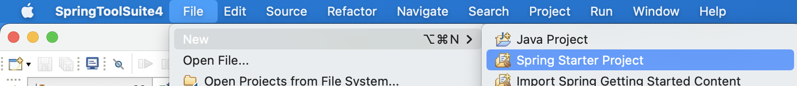

**图 A.1 在 Spring Tool Suite 中启动新项目**

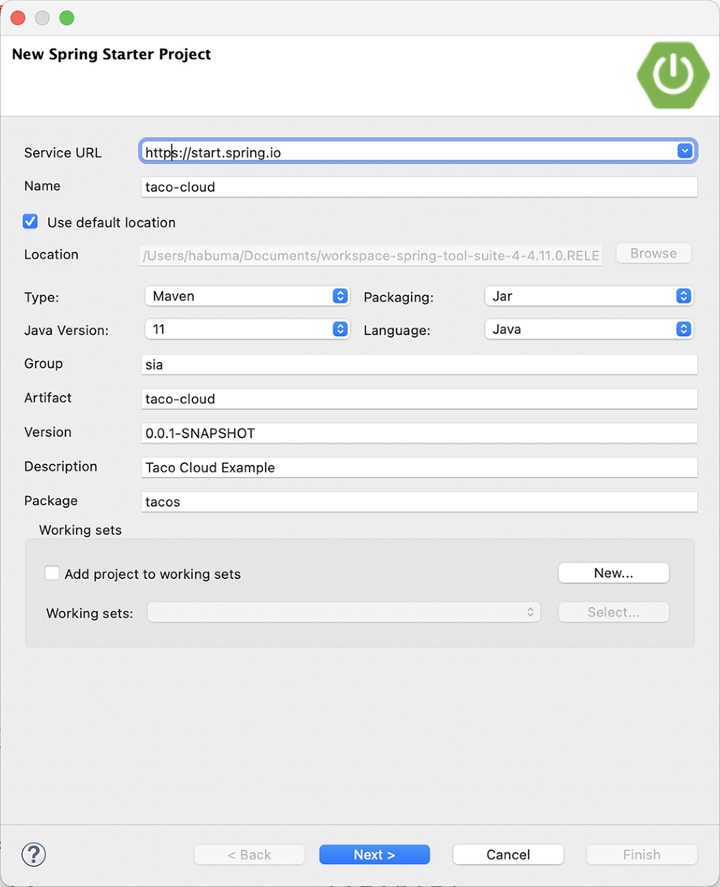

**图 A.2 定义基本项目信息**

此页面上的第一个字段要求你指定 Spring Initializr 服务的位置。如果你正在运行或使用自定义的 Initializr 实例，你需要在此处指定 Initializr 服务的基本 URL。否则，保留默认指向 http://start.spring.io 的设置即可。

定义完基本项目信息后，单击 Next 查看项目依赖页面（见图 A.3）。

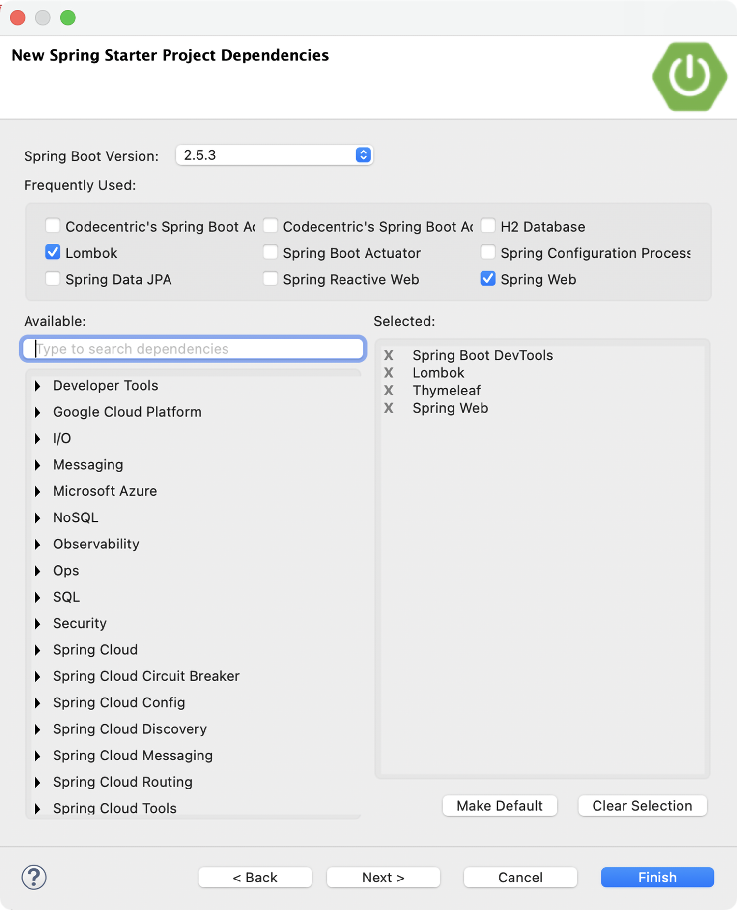

**图 A.3 指定项目依赖**

在项目依赖页面上，你可以指定项目所需的所有依赖。其中许多依赖是 Spring Boot Starter 依赖，尽管一些其他依赖也常用于 Spring 项目。

可用的依赖列在左侧，按可展开或折叠的分组组织。如果找不到某个依赖，你也可以搜索依赖以缩小选择范围。

要将依赖添加到生成的项目中，请选中依赖名称旁边的复选框。你的选择将出现在右侧 Selected 标题下的列表中。你可以通过单击所选依赖旁边的 X 来删除依赖，或单击 Clear Selection 删除所有选定的依赖。

作为额外的便利，如果你发现某些核心依赖集经常（或总是）用于项目，你可以在选择这些依赖后单击 Make Default 按钮，下次创建项目时它们将自动被选中。

选择完成后，单击 Finish 生成项目并将其添加到工作空间中。但是，如果你要使用 http://start.spring.io 之外的 Initializr，请单击 Next 设置 Initializr 基本 URL，如图 A.4 所示。Base Url 字段指定 Initializr API 监听的 URL。这是你可以在此页面上更改的唯一字段。Full Url 字段显示将用于从 Initializr 请求新项目的完整 URL。

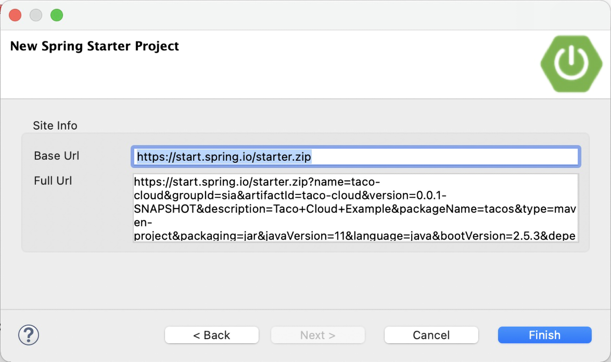

**图 A.4 可选地指定 Initializr 基本 URL**

## A.2 使用 IntelliJ IDEA 初始化项目

要在 IntelliJ IDEA 中开始新的 Spring 项目，请从 File > New 菜单中选择 Project 菜单项，如图 A.5 所示。

这将打开新的 Spring Initializr 项目向导的第一页。你将看到一个要求输入基本项目信息的页面，如图 A.6 所示。

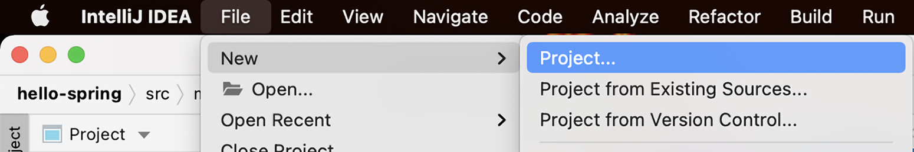

**图 A.5 在 IntelliJ IDEA 中启动新的 Spring 项目**

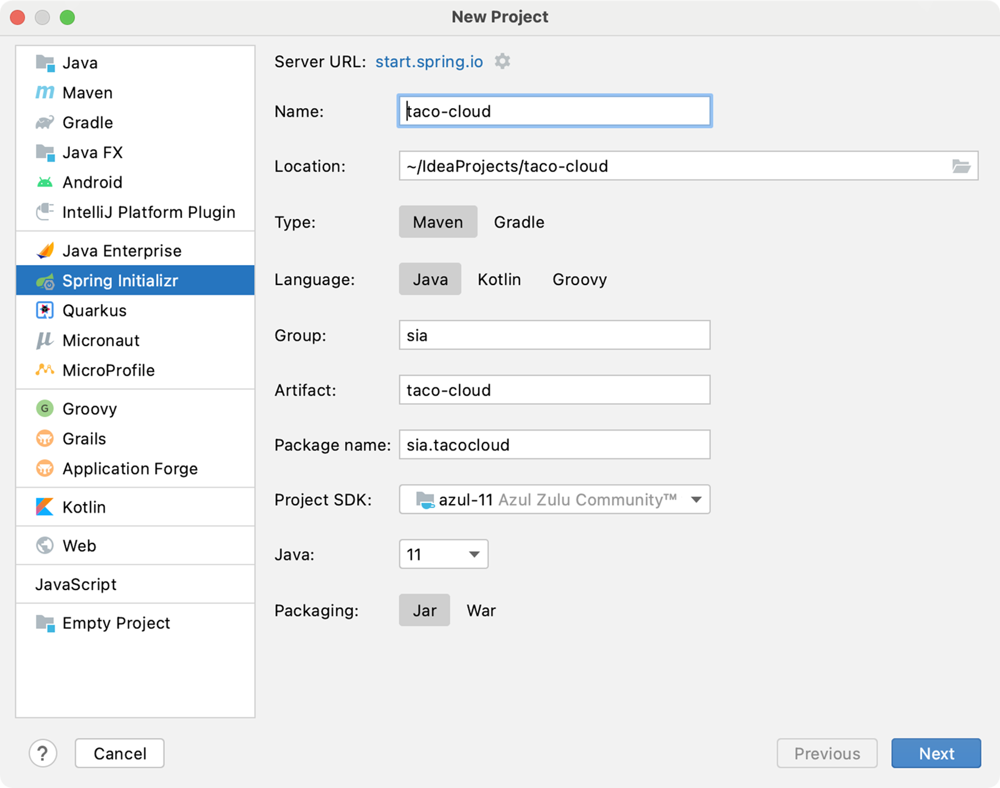

**图 A.6 在 IntelliJ IDEA 中指定基本项目信息**

你可能会认识到此页面上的一些字段是 Maven pom.xml 文件中可能出现的信息——事实上，如果你从 Type 字段中选择 Maven Project，这正是它将被使用的方式。如果 Gradle 是你的首选，欢迎选择 Gradle Project。

填写完基本项目信息后，单击 Next 查看项目依赖页面（见图 A.7）。

依赖按类别组织在最左侧的列表中。选择一个类别将导致该类别的选项显示在中间列表中。你选择的依赖将（按类别）列在右侧列表中。

选择完所有依赖后，单击 Finish。你的项目将被创建并加载到 IntelliJ IDEA 工作空间中。

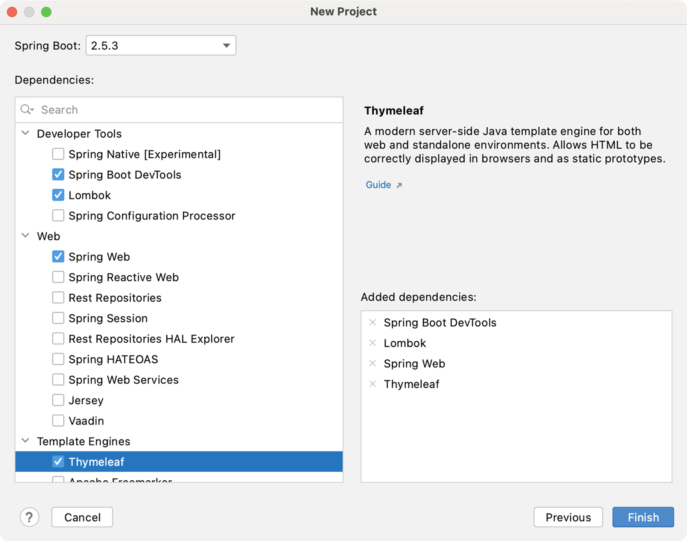

**图 A.7 选择项目依赖**

## A.3 使用 NetBeans 初始化项目

在 NetBeans 中创建新的 Spring Boot 项目之前，你需要安装一个支持 NetBeans 中 Spring Boot 开发的插件。NB Spring Boot 插件为 NetBeans 添加了类似于 Spring Tool Suite 和 IntelliJ IDEA 内置的功能。

要安装插件，请从 Tools 菜单中选择 Plugins 选项，如图 A.8 所示。

你将看到 NetBeans 可用插件的列表，包括 NB Spring Boot 插件，如图 A.9 所示。

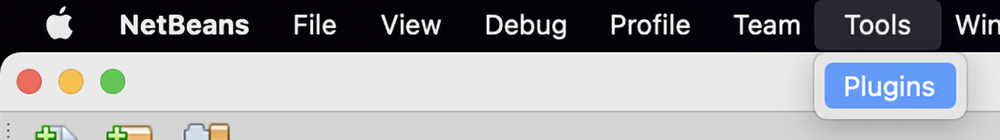

**图 A.8 NetBeans Plugins 菜单项**

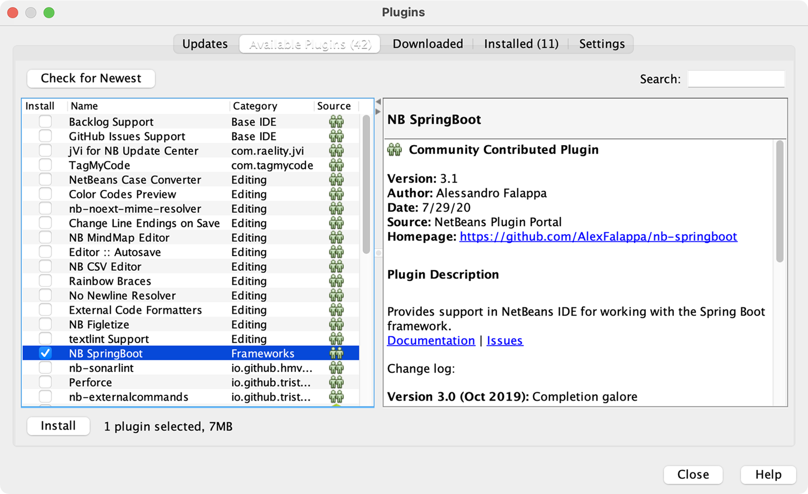

**图 A.9 选择 NB Spring Boot 插件**

单击 Install 开始安装 Spring Boot 插件。你将看到一些对话框来确认你的决定并确认插件许可协议。只需单击 Next 直到最后一个，然后单击 Install。最后，你将被提示重启 NetBeans 以使插件生效。

安装 Spring Boot 插件后，你就可以在 NetBeans 中初始化新的 Spring Boot 项目了。要在 NetBeans 中创建新的 Spring 项目，请从 File 菜单中选择 New Project 菜单项，如图 A.10 所示。

你将看到新项目向导的第一页。如图 A.11 所示，此页面让你选择要创建的项目类型。

对于 Spring Boot 项目，从左侧的类别列表中选择 Java with Maven，然后从右侧的项目列表中选择 Spring Boot Initializr Project。然后单击 Next 转到下一页。

新项目向导中的第二页（图 A.12）让你设置基本的项目信息，例如项目名称、版本和其他最终将用于在 Maven pom.xml 文件中定义项目的信息。

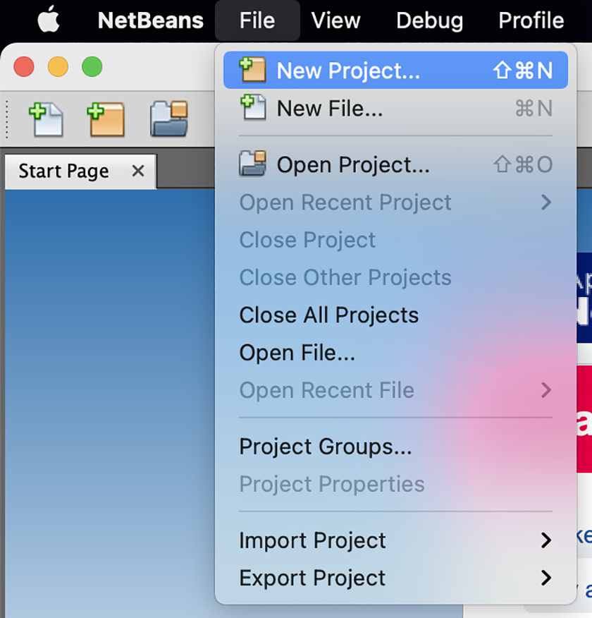

**图 A.10 在 NetBeans 中启动新的 Spring 项目**

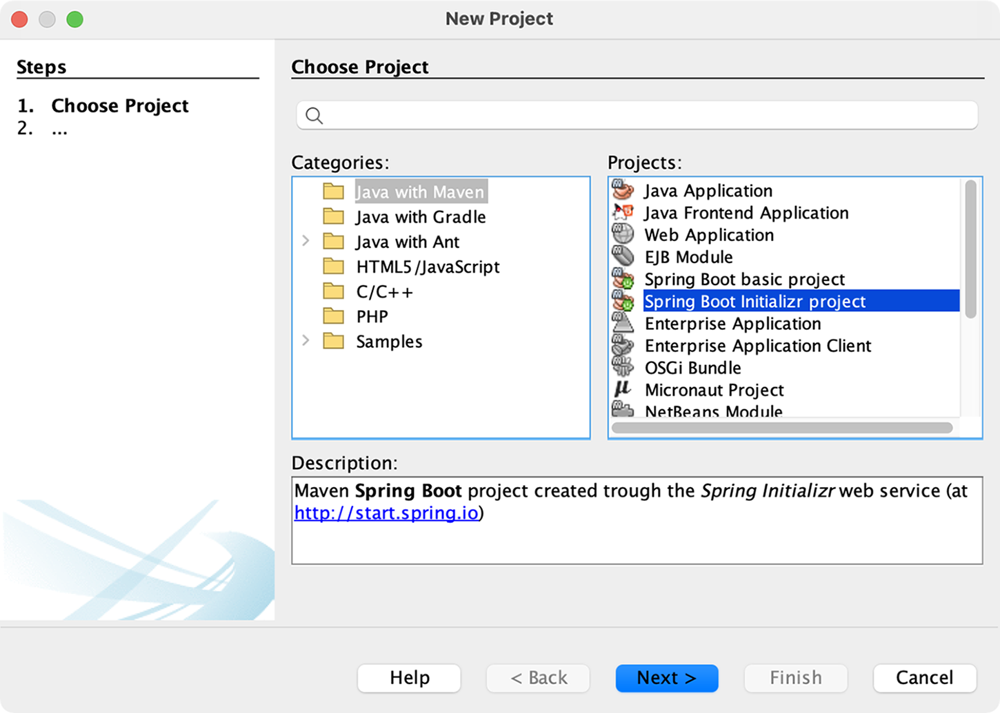

**图 A.11 创建新的 Spring Boot Initializr 项目**

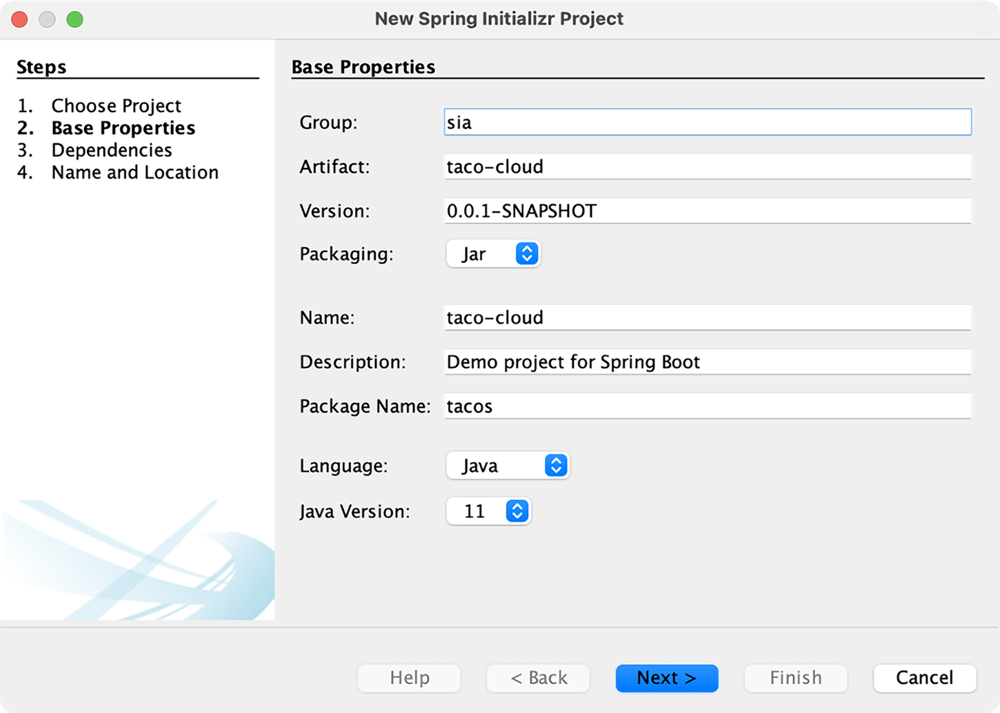

**图 A.12 指定基本项目信息**

指定基本项目信息后，单击 Next 导航到新项目向导中的依赖页面，如图 A.13 所示。

依赖都以复选框的形式列在同一个列表中，按类别组织。如果找不到所需的特定依赖，可以使用顶部的 Filter 文本框来限制选项列表。

你还可以在此页面上指定要使用的 Spring Boot 版本。默认情况下，它将设置为当前正式发布的 Spring Boot 版本。

选择项目依赖后，单击 Next 导航到新项目向导的最后一页，如图 A.14 所示。此页面让你指定项目的最终详细信息，包括项目名称和文件系统上的位置。（Project Folder 字段是只读的，由其他两个字段派生。）它还为你提供了通过 Maven Spring Boot 插件而不是通过 NetBeans 运行和调试项目的选项。你也可以选择让 NetBeans 从生成的项目中删除 Maven 包装器。

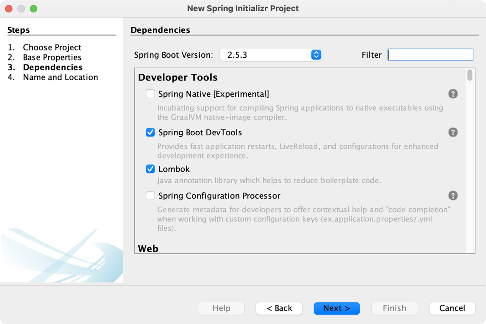

**图 A.13 选择项目依赖**

设置完最后的项目信息后，单击 Finish 生成项目并将其添加到 NetBeans 工作空间中。

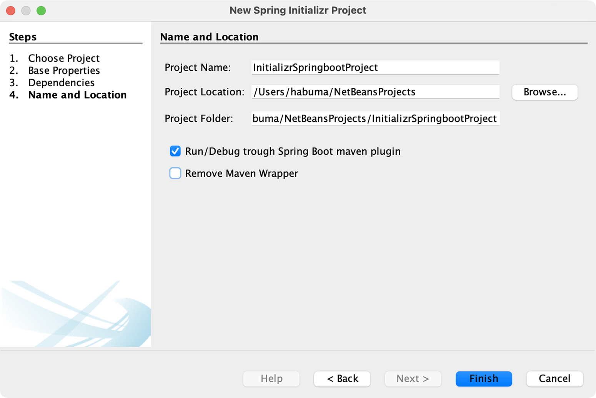

**图 A.14 指定项目的名称和位置**

## A.4 在 start.spring.io 上初始化项目

尽管上述基于 IDE 的初始化选项之一可能满足你的需求，但你可能使用完全不同的 IDE，或者你可能更喜欢使用更简单的文本编辑器。在这种情况下，你仍然可以使用基于 Web 的 Initializr 界面来利用 Spring Initializr。

要开始，请将你喜欢的 Web 浏览器定向到 https://start.spring.io。你应该会看到 Spring Initializr Web 用户界面的简单版本，如图 A.15 所示。

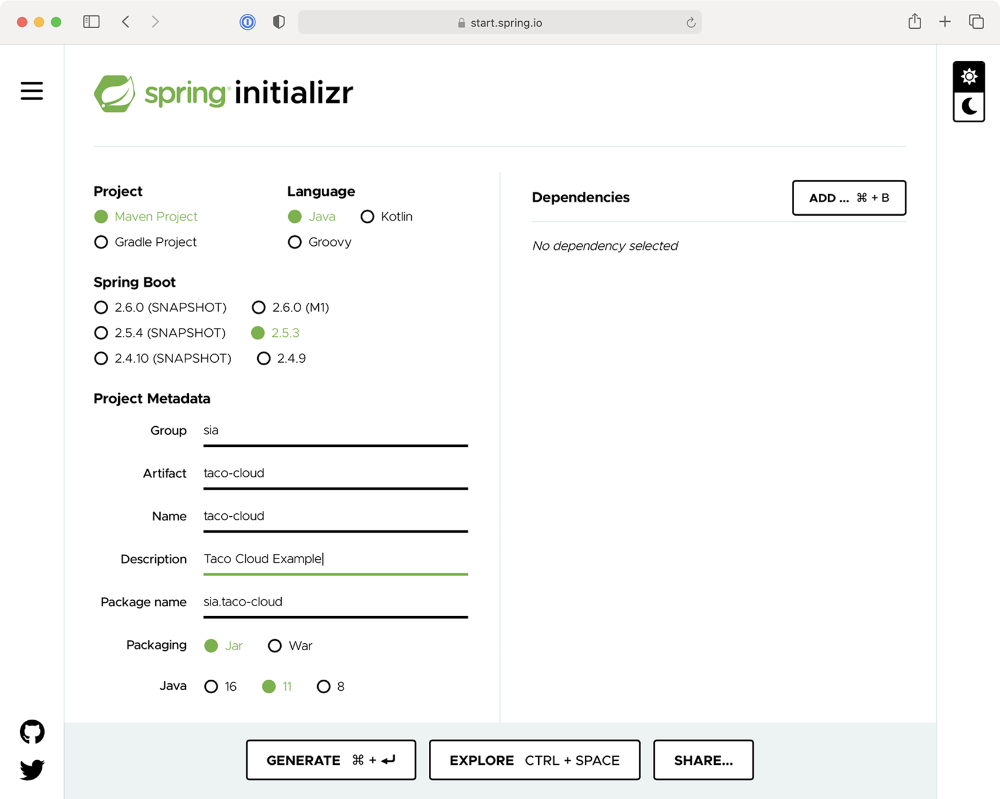

**图 A.15 Spring Initializr Web 界面的简单版本**

在 Initializr Web 应用程序的简单版本中，你会被要求提供一些非常基本的信息，包括使用 Maven 还是 Gradle 构建、使用哪种语言开发项目、使用哪个版本的 Spring Boot 以及项目的 group 和 artifact ID。

你还可以通过在搜索框中输入搜索条件来指定依赖。例如，如图 A.16 所示，你可以输入 web 来搜索任何以 "web" 为关键字的依赖。

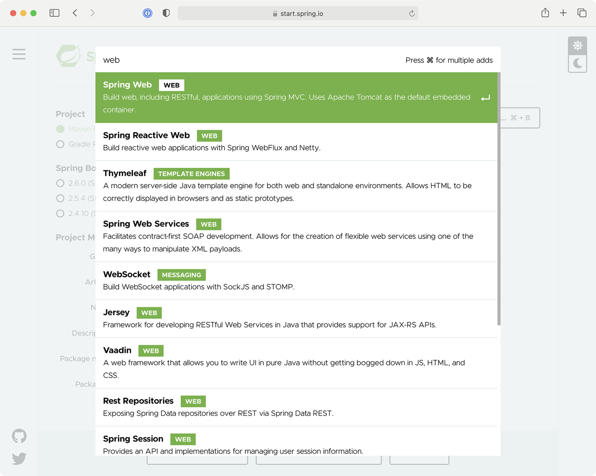

**图 A.16 搜索依赖**

当你看到所需的依赖时，按键盘上的 Return 键选择它，它将被添加到选定依赖的列表中。图 A.17 中 Selected Dependencies 下方的方框显示已选择 Web、Thymeleaf、DevTools 和 Lombok 依赖。

如果你决定不需要某个选定的依赖，可以单击依赖条目右侧的 X 来删除它。完成后，你可以单击 Generate Project（或使用按钮上显示的键盘快捷键，因操作系统而异）让 Initializr 生成项目并将其作为 zip 文件下载。然后你可以解压项目并在你选择的任何 IDE 或编辑器中加载它。

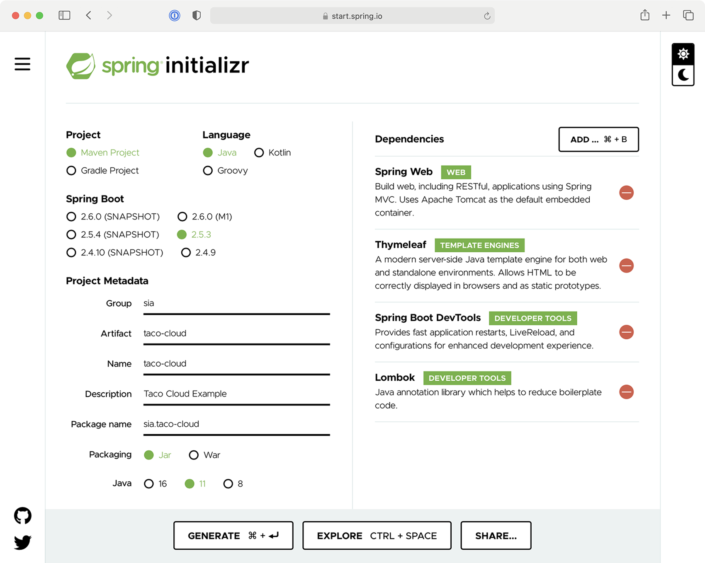

**图 A.17 选择依赖**

在单击 Generate Project 之前，你可以通过单击 Explore 来预览项目。这将弹出一个带有项目资源管理器的对话框，类似于图 A.18 所示的那个。

项目的构建规范（Maven pom.xml 文件或 Gradle build.gradle 文件）将首先显示。通过单击左侧树中的项目，你可以查看项目中将包含哪些其他工件。

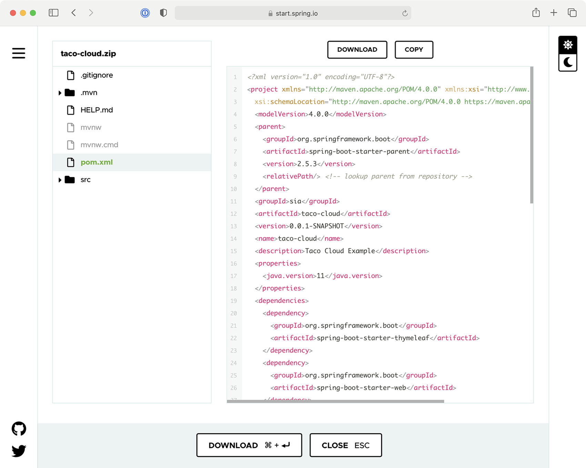

**图 A.18 Initializr 用户界面的完整版本**

## A.5 从命令行初始化项目

Spring Initializr 的基于 IDE 和浏览器的用户界面可能是引导项目的最常用方式。它们都是 Initializr 应用程序提供的 REST 服务的客户端。在某些特殊情况下（例如，在脚本化场景中），你可能会发现直接从命令行使用 Initializr 服务很有用。

你可以通过以下两种方式使用 API：

- 使用 curl 命令（或类似的命令行 REST 客户端命令）
- 使用 Spring Boot 命令行界面（即 Spring Boot CLI）

让我们看看这些选项，从 curl 命令开始。

### curl 和 Initializr API

使用 curl 引导 Spring 项目的最简单方法是像这样使用 API：

```bash
% curl https://start.spring.io/starter.zip -o demo.zip
```

在这种情况下，你正在请求 Initializr 的 /starter.zip 端点，它将生成一个 Spring 项目并将其作为 zip 文件下载。生成的项目将是 Maven 构建的，除了基础的 Spring Boot starter 依赖外没有任何依赖。项目 pom.xml 文件中的所有项目信息都将设置为默认值。

如果你不另行指定，文件名将为 starter.zip。但在这种情况下，-o 选项指定下载的文件应命名为 demo.zip。

公开可用的 Spring Initializr 服务器托管在 https://start.spring.io，但如果你使用自定义的 Initializr，你需要相应地调整给定的 URL。

你可能需要指定比给定默认值更多的详细信息和依赖。表 A.1 列出了使用 Spring Initializr REST 服务时的所有参数（及其默认值）。

**表 A.1 Initializr API 支持的请求参数**

| 参数 | 描述 | 默认值 |
|------|------|--------|
| groupId | 项目的 group ID，用于在 Maven 仓库中组织 | com.example |
| artifactId | 项目的 artifact ID，如在 Maven 仓库中显示 | demo |
| version | 项目版本 | 0.0.1-SNAPSHOT |
| name | 项目名称；也用于确定应用程序主类的名称（带 Application 后缀） | demo |
| description | 项目描述 | Demo project for Spring Boot |
| packageName | 项目的基础包名 | com.example.demo |
| dependencies | 要包含在项目构建规范中的依赖 | 基础 Spring Boot starter |
| type | 要生成的项目类型：maven-project 或 gradle-project | maven-project |
| javaVersion | 用于构建的 Java 版本 | 1.8 |
| bootVersion | 用于构建的 Spring Boot 版本 | 当前 GA 版本的 Spring Boot |
| language | 要使用的编程语言：java、groovy 或 kotlin | java |
| packaging | 项目的打包方式：jar 或 war | jar |
| applicationName | 应用程序名称 | name 参数的值 |
| baseDir | 生成的归档文件中的基础目录名称 | 根目录 |

你也可以通过向基本 Initializr URL 发出简单请求来获取此参数列表以及可用依赖列表：

```bash
% curl https://start.spring.io
```

dependencies 参数可能是最有用的。例如，假设你想创建一个简单的 Spring Web 项目。以下 curl 命令行用法将生成一个带有 web starter 依赖的项目 zip：

```bash
% curl https://start.spring.io/starter.zip \
      -d dependencies=web \
      -o demo.zip
```

作为一个更复杂的例子，假设你想开发一个使用 Spring Data JPA 进行数据持久化的 Web 应用程序。你还想使用 Gradle 构建，项目应该位于 zip 文件中名为 my-dir 的目录下。并且假设你不想只下载 zip 文件，而是希望在下载时将项目解压到文件系统中。在这种情况下，以下命令应该可以完成任务：

```bash
% curl https://start.spring.io/starter.tgz \
       -d dependencies=web,data-jpa \
       -d type=gradle-project \
       -d baseDir=my-dir | tar -xzvf -
```

在这里，下载的 zip 文件通过管道传递给 tar 命令进行解压。

### Spring Boot 命令行界面

Spring Boot CLI 是初始化 Spring 应用程序的另一个选择。你可以通过多种方式安装 Spring Boot CLI，但最简单的方式（也是我最喜欢的方式）是使用 SDKMAN (http://sdkman.io/))，如下所示：

```bash
% sdk install springboot
```

安装 Spring Boot CLI 后，你可以开始使用它来生成项目，就像使用 curl 一样。你将使用的命令是 spring init。事实上，使用 Spring Boot CLI 生成项目的最简单方法是：

```bash
% spring init
```

这将下载一个名为 demo.zip 的 zip 文件中的精简 Spring Boot 项目。但是，你可能需要指定更多的详细信息和依赖。表 A.2 列出了 spring init 命令可用的所有参数。

你也可以通过使用 --list 参数获取此参数列表以及可用依赖列表：

```bash
% spring init --list
```

假设你希望创建一个基于 Java 1.7 构建的 Web 应用程序。以下命令使用 --dependencies 和 --java 参数进行这些选择：

```bash
% spring init --dependencies=web --java-version=1.7
```

或者假设你想创建一个使用 Spring Data JPA 进行持久化的 Web 应用程序，并且你想使用 Gradle 而不是 Maven 进行构建。你将使用以下命令：

```bash
% spring init --dependencies=web,jpa --type=gradle-project
```

**表 A.2 spring init 命令支持的请求参数**

| 参数 | 描述 | 默认值 |
|------|------|--------|
| group-id | 项目的 group ID，用于在 Maven 仓库中组织 | com.example |
| artifact-id | 项目的 artifact ID，如在 Maven 仓库中显示 | demo |
| version | 项目版本 | 0.0.1-SNAPSHOT |
| name | 项目名称；也用于确定应用程序主类的名称（带 Application 后缀） | demo |
| description | 项目描述 | Demo project for Spring Boot |
| package-name | 项目的基础包名 | com.example.demo |
| dependencies | 要包含在项目构建规范中的依赖 | 基础 Spring Boot starter |
| type | 要生成的项目类型：maven-project 或 gradle-project | maven-project |
| java-version | 用于构建的 Java 版本 | 11 |
| boot-version | 用于构建的 Spring Boot 版本 | 当前 GA 版本的 Spring Boot |
| language | 要使用的编程语言：java、groovy 或 kotlin | java |
| packaging | 项目的打包方式：jar 或 war | jar |

你可能还会注意到，许多 spring init 参数与 curl 选项的参数相同或相似。也就是说，spring init 命令并不支持与 curl 选项相同的所有参数（例如 baseDir），并且参数使用连字符分隔而不是驼峰命名法（例如 package-name 而不是 packageName）。

## A.6 构建和运行项目

无论你如何初始化项目，你始终可以使用 java -jar 命令从命令行运行应用程序，如下所示：

```bash
% java -jar demo.jar
```

即使你决定创建 WAR 文件分发而不是 JAR 文件，这也可以工作，如下所示：

```bash
% java -jar demo.war
```

你还可以利用 Spring Boot Maven 和 Gradle 插件来运行应用程序。例如，如果你的项目是使用 Maven 构建的，你可以这样运行：

```bash
% mvn spring-boot:run
```

另一方面，如果你选择使用 Gradle 构建项目，你可以这样运行项目：

```bash
% gradle bootRun
```

无论使用 Maven 还是 Gradle，构建工具都会先构建项目（如果尚未构建）然后运行它。
