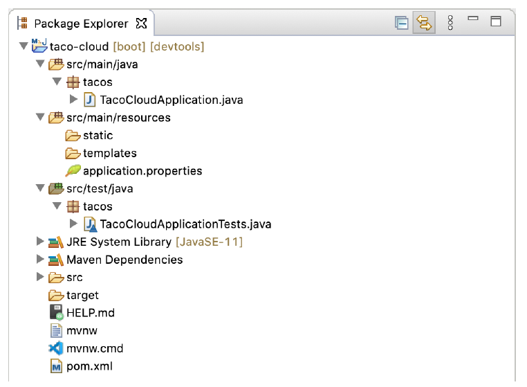

# 1.2.2 检查 Spring 项目结构

在 IDE 中加载项目后，将其展开以查看其中包含的内容。图 1.6 显示了 Spring Tool Suite 中扩展的 Taco Cloud 项目。


**图 1.6 Spring Tool Suite 中的 Spring 项目结构** <br/>

您可能会认为这是典型的 Maven 或 Gradle 项目结构，其中应用程序源代码位于src/main/java 下，测试代码位于 src/test/java 下，非 Java 资源位于 src/main/resources 下 。在该项目结构中，需要注意以下事项：

* `mvnw` 和 `mvnw.cmd` —— 这些是 Maven 包装器脚本。即使您的计算机上没有安装 Maven，也可以使用这些脚本构建项目。
* `pom.xml` —— 这是 Maven 构建规范，一会儿我们将对此进行更深入的研究。
* `TacoCloudApplication.java` —— 这是引导项目的 Spring Boot 主类。稍后，我们将在这节详细介绍。
* `application.properties` —— 该文件最初为空，但提供了一个可以指定配置属性的地方。我们将在本章中对此文件进行一些修改，但在第 5 章中将详细介绍配置属性。
* `static` —— 在此文件夹中，可以放置要提供给浏览器的任何静态内容（图像、样式表、JavaScript 等），最初为空。
* `templates` —— 在此文件夹中，放置用于向浏览器呈现内容的模板文件。最初为空，但很快会添加 Thymeleaf 模板。
* `TacoCloudApplicationTests.java` —— 这是一个简单的测试类，可确保成功加载 Spring 应用程序上下文。开发应用程序时，将添加更多的测试。

随着 Taco Cloud 应用程序的增长，将使用 Java 代码、图像、样式表、测试以及其他可帮助完成项目的附带材料来填充此准系统的项目结构。但是与此同时，让我们更深入地研究 Spring Initializr 提供的一些选项。

### 探索构建规范

填写 Initializr 表单时，指定应使用 Maven 构建项目。因此，Spring Initializr 给了您一个 pom.xml 文件，该文件已经填充了您所做的选择。下面的程序清单显示了 Initializr 提供的整个 pom.xml 文件。

**程序清单 1.1 初始化 Maven 构建规范**

```xml
<?xml version="1.0" encoding="UTF-8"?>
<project xmlns="http://maven.apache.org/POM/4.0.0"
  xmlns:xsi="http://www.w3.org/2001/XMLSchema-instance"
  xsi:schemaLocation="http://maven.apache.org/POM/4.0.0
    https://maven.apache.org/xsd/maven-4.0.0.xsd">
  <modelVersion>4.0.0</modelVersion>
  <parent>
    <groupId>org.springframework.boot</groupId>
    <artifactId>spring-boot-starter-parent</artifactId>
    <version>2.5.3</version>
    <relativePath />
  </parent>
  <groupId>sia</groupId>
  <artifactId>taco-cloud</artifactId>
  <version>0.0.1-SNAPSHOT</version>
  <name>taco-cloud</name>
  <description>Taco Cloud Example</description>

  <properties>
    <java.version>11</java.version>
  </properties>

  <dependencies>
    <dependency>
      <groupId>org.springframework.boot</groupId>
      <artifactId>spring-boot-starter-thymeleaf</artifactId>
    </dependency>

    <dependency>
      <groupId>org.springframework.boot</groupId>
      <artifactId>spring-boot-starter-web</artifactId>
    </dependency>

    <dependency>
      <groupId>org.springframework.boot</groupId>
      <artifactId>spring-boot-devtools</artifactId>
      <scope>runtime</scope>
      <optional>true</optional>
    </dependency>

    <dependency>
      <groupId>org.springframework.boot</groupId>
      <artifactId>spring-boot-starter-test</artifactId>
      <scope>test</scope>
      <exclusions>
        <exclusion>
          <groupId>org.junit.vintage</groupId>
          <artifactId>junit-vintage-engine</artifactId>
        </exclusion>
      </exclusions>
    </dependency>

  </dependencies>

  <build>
    <plugins>
      <plugin>
        <groupId>org.springframework.boot</groupId>
        <artifactId>spring-boot-maven-plugin</artifactId>
      </plugin>
    </plugins>
  </build>

  <repositories>
    <repository>
      <id>spring-milestones</id>
      <name>Spring Milestones</name>
      <url>https://repo.spring.io/milestone</url>
    </repository>
  </repositories>
  <pluginRepositories>
    <pluginRepository>
      <id>spring-milestones</id>
      <name>Spring Milestones</name>
      <url>https://repo.spring.io/milestone</url>
    </pluginRepository>
  </pluginRepositories>
</project>
```

第一个值得注意的项是 `<parent>` 元素，更具体地说，注意它的 `<version>` 子元素。这指定您的项目将 `spring-boot-starter-parent` 作为它的父 POM。除此之外，这个父 POM 还为 Spring 项目中常用的几个库提供依赖项管理。对于父 POM 覆盖的那些库，不必指定版本，因为它是从父 POM 继承的。版本 `2.5.3` ，表示您正在使用 Spring Boot 2.5.3，这样项目将使用继承自 Spring Boot 版本中定义的依赖项管理。除此之外，Spring Boot 的版本依赖关系管理 2.5.3 规定核心 Spring 框架的基础版本为 5.3.9。

在讨论依赖项时，请注意在 `<dependencies>` 元素下声明了四个依赖项。前三个看起来应该比较熟悉。它们直接对应于在单击 Spring Tool Suite 新建项目向导中的 Finish 按钮之前选择的 Web 、Thymeleaf 以及 Spring Boot DevTools 依赖项。第四个依赖项提供了许多有用的测试功能，您不必选中包含它的方框，因为 Spring Initializr 假定（希望是正确的）您将编写测试。

您可能还会注意到，除  Spring Boot DevTools 以外的这些依赖项的 artifact ID 中都有 _starter_ 这个词。Spring Boot starter 依赖项的特殊之处在于，它们本身通常没有任何库代码，而是间接地引入其他库。这些 starter 依赖提供了三个主要的好处：

* 构建的文件将会小得多，也更容易管理，因为不需要对每一个可能需要的库都声明一个依赖项。
* 可以根据它们提供的功能来考虑需要的依赖关系，而不是根据库名来考虑。如果正在开发一个 web 应用程序，那么将添加 web starter 依赖项，而不是一个编写 web 应用程序的各个库的清单。
* 不用担心 library 版本问题。可以相信的是，对于给定版本的 Spring Boot，可间接地引入的库的版本将是兼容的，只需要考虑使用的是哪个版本的 Spring Boot。

最后，构建规范以 Spring Boot 插件结束。这个插件执行一些重要的功能：

* 提供了一个 Maven 编译目标，让您能够使用 Maven 运行应用程序。这将在第 1.3.4 节中尝试实现这个目标。
* 确保所有的依赖库都包含在可执行的 JAR 文件中，并且在运行时类路径中可用。
* 在 JAR 文件中生成一个 manifest 文件，表示引导类（在本书例子中是 `TacoCloudApplication`）是可执行 JAR 的主类。

说到引导类，让我们打开它，仔细看看。

### 引导应用程序

因为将从一个可执行的 JAR 运行应用程序，所以在运行 JAR 文件时，有一个主类来执行是很重要的。还需要至少一个最小的 Spring 配置文件来引导应用程序。这就是将在 `TacoCloudApplication` 类中找到的内容：

**程序清单 1.2 Taco Cloud 引导类** 

```java
package tacos;

import org.springframework.boot.SpringApplication;
import org.springframework.boot.autoconfigure.SpringBootApplication;

@SpringBootApplication
public class TacoCloudApplication {

  public static void main(String[] args) {
    SpringApplication.run(TacoCloudApplication.class, args);
  }

}
```

虽然 `TacoCloudApplication` 中只有很少的代码，但是其中包含了相当丰富的内容。最强大的代码行之一也是最短的代码行之一。`@SpringBootApplication` 注释清楚地表明这是一个 Spring 引导应用程序。但是 `@SpringBootApplication` 中有更多的东西。

`@SpringBootApplication` 是一个组合了其他三个注释的复合应用程序：

* `@SpringBootConfiguration` —— 指定这个类为配置类。尽管这个类中还没有太多配置，但是如果需要，可以将 Javabased Spring Framework 配置添加到这个类中。实际上，这个注释是`@Configuration` 注释的一种特殊形式。
* `@EnableAutoConfiguration` —— 启用 Spring 自动配置。稍后我们将详细讨论自动配置。现在，要知道这个注释告诉 Spring Boot 自动配置它认为需要的任何组件。
* `@ComponentScan` —— 启用组件扫描。这允许您声明其他带有 `@Component`、`@Controller`、`@Service` 等注释的类，以便让 Spring 自动发现它们并将它们注册为 Spring 应用程序上下文中的组件。

`TacoCloudApplication` 的另一个重要部分是 `main()` 方法。这个方法将在执行 JAR 文件时运行。在大多数情况下，这种方法是样板代码；编写的每个 Spring 引导应用程序都有一个类似或相同的方法（尽管类名不同）。

`main()` 方法调用 SpringApplication 类上的静态 `run()` 方法，该方法执行应用程序的实际引导，创建`Spring` 应用程序上下文。传递给 `run()` 方法的两个参数是一个配置类和命令行参数。虽然传递给 `run()` 的配置类不必与引导类相同，但这是最方便、最典型的选择。

您可能不需要更改引导类中的任何内容。对于简单的应用程序，您可能会发现在引导类中配置一两个其他组件很方便，但是对于大多数应用程序，最好为任何没有自动配置的东西创建一个单独的配置类。您将在本书的整个过程中定义几个配置类，因此请注意这些细节。

### 测试应用程序

测试是软件开发的一个重要部分。您始终可以手动测试项目，这通过先构建它，然后从命令行运行它，如下所示：

```bash
$ ./mvnw package
...
$ java -jar target/taco-cloud-0.0.1-SNAPSHOT.jar

```

或者，由于我们使用的是 Spring Boot，Spring Boot Maven 插件使它变得更加简单：

```bash
$ ./mvnw spring-boot:run
```

但手动测试意味着涉及到人为因素，因此可能会出现人为错误和不一致的测试。自动化测试更加一致且可重复。

认识到这一点后，Spring Initializr 提供了一个测试类。下面的清单显示了基准测试类。

**程序清单 1.3 基准应用测试**
```java
package tacos;

import org.junit.jupiter.api.Test;
import org.springframework.boot.test.context.SpringBootTest;

@SpringBootTest
public class TacoCloudApplicationTests {

  @Test
  public void contextLoads() {
  }

}
```

在 `TacoCloudApplicationTests` 中没有太多东西：类中的一个测试方法是空的。尽管如此，这个测试类确实执行了必要的检查，以确保 Spring 应用程序上下文能够成功加载。如果做了任何阻止创建 Spring 应用程序上下文的更改，则此测试将失败，这样您就可以通过解决问题来应对。

`@SpringBootTest` 告诉 JUnit 使用 Spring Boot 功能引导测试。与 `@SpringBootApplication` 一样，`@SpringBootTest` 是一个复合注解，它本身用 `@ExtendWith（SpringExtension.class）` 注解，以添加 Spring 测试功能到 JUnit5 中。不过，就目前而言，将其视为与 `main()` 方法调用 `SpringApplication.run()` 等效的测试类就足够了。在本书整个过程中，将多次看到 `@SpringBootTest`，我们将揭示它的一些功能。

最后，还有测试方法本身。尽管 `@SpringBootTest` 的任务是加载测试的 Spring 应用程序上下文，如果没有任何测试，它将没有任何作用。即使没有任何断言或任何类型的代码，这个空的测试方法也会调用两个注释完成它们的工作，并加载 Spring 应用程序上下文。如果运行过程中有任何问题，测试就会失败。

要从命令行运行该类和任何测试类，可以使用以下 Maven 命令：

```bash
$ ./mvnw test
```

至此，我们已经完成了对 Spring Initializr 提供的代码的回顾。看到了一些用于开发 Spring 应用程序的样板基础，但是仍然没有编写任何代码。现在，启动 IDE，掸掉键盘上的灰尘，并向 Taco Cloud 应用程序添加一些定制代码。

