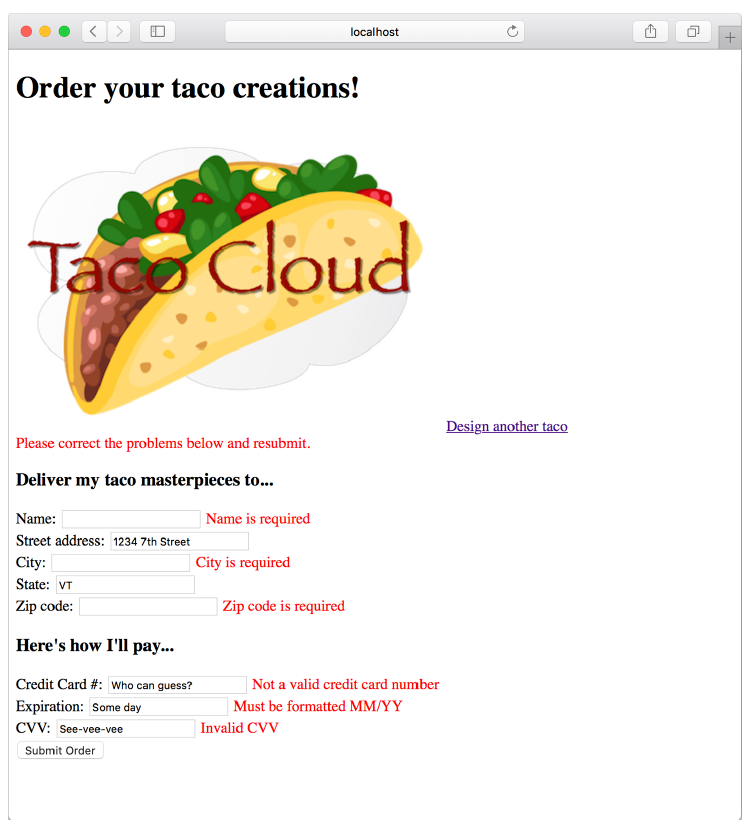

### 2.3.3 显示验证错误

Thymeleaf 通过 fields 属性及其 `th:errors` 属性提供了对 Errors 对象的便捷访问。例如，要在信用卡号字段上显示验证错误，可以添加一个 `<span>` 元素，该元素将这些错误引用用于订单模板，如下所示。

**程序清单 2.15 显示验证错误**

```html
<<label for="ccNumber">Credit Card #: </label>
<input type="text" th:field="*{ccNumber}"/>
<span class="validationError"
      th:if="${#fields.hasErrors('ccNumber')}"
      th:errors="*{ccNumber}">CC Num Error</span>
```

除了可以用来设置错误样式以引起用户注意的 class 属性外，`<span>` 元素还使用 `th:if` 属性来决定是否显示 `<span>`。fields 属性的 `hasErrors()` 方法检查 ccNumber 字段中是否有任何错误。如果有错误，`<span>` 将被渲染。

`th:errors` 属性引用 ccNumber 字段，并且假设该字段存在错误，它将用验证消息替换 `<span>` 元素的占位符内容。

如果在其他字段的订单表单周围使用类似的 `<span>` 标记，则在提交无效信息时可能会看到类似图 2.5 的表单。这些错误表明姓名、城市和邮政编码字段被留空，所有的支付字段都不符合验证标准。


**图 2.5 在订单表单上显示验证错误** <br/>

现在 Taco Cloud 控制器不仅可以显示和捕获输入，还可以验证信息是否符合一些基本的验证规则。让我们后退一步，重新考虑第 1 章中的 HomeController，看看另一种实现。


