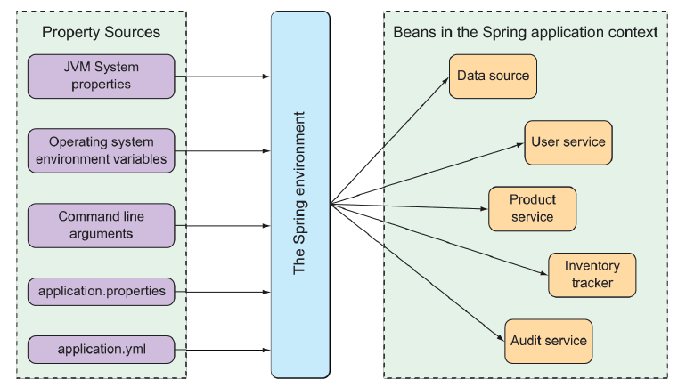

### 6.1.1 理解 Spring 环境抽象

Spring 环境抽象是任何可配置属性的一站式商店。它抽象了属性的起源，以便需要这些属性的 bean 可以从 Spring 本身使用它们。Spring 环境来自几个属性源，包括：

* JVM 系统属性
* 操作系统环境变量
* 命令行参数
* 应用程序属性配置文件

然后，它将这些属性聚合到单一的源中，从这个源中可以注入 Spring bean。图 6.1 演示了来自属性源的属性是如何通过 Spring 环境抽象流到 Spring bean 中的。


**图 6.1 Spring 环境从属性源获取属性，并使它们能够在应用程序上下文中的 bean 获取。** <br/>

通过 Spring Boot 自动配置的 bean 都可以通过从 Spring 环境中提取的属性进行配置。作为一个简单的例子，假设希望应用程序的底层 servlet 容器侦听某些端口上的请求，而不是默认端口 8080。为此，通过在 src/main/resources/application.properties 文件中的 server.port 属性来指定一个不同的接口，如下所示：

```xml
server.port=9090
```

就我个人而言，我更喜欢在设置配置属性时使用 YAML。因此，我可能设置在 /src/main/resources/application.yml 文件中的 server.port 的值，而不是使用 application.properties 文件，如下所示：

```yaml
server:
  port: 9090
```

如果希望在外部配置该属性，还可以在启动应用程序时使用命令行参数指定端口：

```bash
$ java -jar tacocloud-0.0.5-SNAPSHOT.jar --server.port=9090
```

如果想让应用程序总是在一个特定的端口上启动，可以把它设置为一个操作系统环境变量：

```bash
$ export SERVER_PORT=9090
```

注意，在将属性设置为环境变量时，命名风格略有不同，以适应操作系统对环境变量名称的限制。Spring 能够将其分类并将 SERVER_PORT 转译为 server.port。

正如我所说的，有几种设置配置属性的方法。当我们讲到第 14 章的时候，您会看到在一个集中的配置服务器中设置配置属性的另一种方法。实际上，可以使用几百个配置属性来调整 Spring bean 的行为。您已经看到了一些：本章中的 server.port 和前一章的 security.user.name 和 security.user.password。

在本章中不可能测试所有可用的配置属性。尽管如此，让我们来看看一些可能经常遇到的最有用的配置属性。我们将从几个属性开始，这些属性允许您调整自动配置的数据源。


