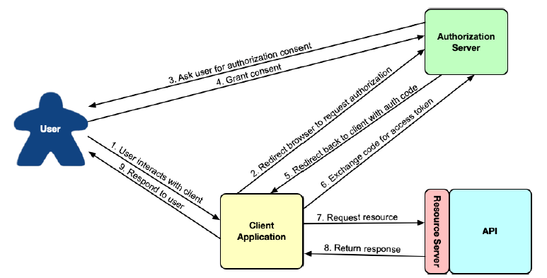

## 8.1 OAuth 2 介绍

假设，我们想要创建一个新的后台应用程序来管理 Taco Cloud 应用。更具体地说，我们希望这个新应用程序，能够管理 Taco Cloud 网站上提供的配料。

在开始为管理应用程序编写代码之前，我们需要添加一些 Taco Cloud API 的新接口以支持配料管理。清单 8.1 所示的 REST 控制器
提供了列表查询、添加和删除配料的三个接口。

**程序清单 8.1 管理可用材料的控制器**

```java
package tacos.web.api;

import org.springframework.beans.factory.annotation.Autowired;
import org.springframework.http.HttpStatus;
import org.springframework.web.bind.annotation.CrossOrigin;
import org.springframework.web.bind.annotation.DeleteMapping;
import org.springframework.web.bind.annotation.GetMapping;
import org.springframework.web.bind.annotation.PathVariable;
import org.springframework.web.bind.annotation.PostMapping;
import org.springframework.web.bind.annotation.RequestBody;
import org.springframework.web.bind.annotation.RequestMapping;
import org.springframework.web.bind.annotation.ResponseStatus;
import org.springframework.web.bind.annotation.RestController;

import tacos.Ingredient;
import tacos.data.IngredientRepository;

@RestController
@RequestMapping(path="/api/ingredients", produces="application/json")
@CrossOrigin(origins="*")
public class IngredientController {

  private IngredientRepository repo;

  @Autowired
  public IngredientController(IngredientRepository repo) {
    this.repo = repo;
  }

  @GetMapping
  public Iterable<Ingredient> allIngredients() {
    return repo.findAll();
  }

  @PostMapping
  @ResponseStatus(HttpStatus.CREATED)
  public Ingredient saveIngredient(@RequestBody Ingredient ingredient) {
    return repo.save(ingredient);
  }

  @DeleteMapping("/{id}")
  @ResponseStatus(HttpStatus.NO_CONTENT)
  public void deleteIngredient(@PathVariable("id") String ingredientId) {
    repo.deleteById(ingredientId);
  }
}
```

很好！现在我们需要做的就是开始管理应用程序，根据需要调用 Taco Cloud 应用程序上的接口添加或删除材料。

但是等等。这个 API 还没有任何安全性。如果我们的后端应用程序可以使 HTTP 请求添加和删除配料，其他人也可以。甚至使用 curl 命令行，就可以添加如下新配料：

```bash
$ curl localhost:8080/ingredients \
  -H"Content-type: application/json" \
  -d'{"id":"FISH","name":"Stinky Fish", "type":"PROTEIN"}'
```

甚至可以使用 curl 删除存在的配料：

```bash
$ curl localhost:8080/ingredients/GRBF -X DELETE
```

此 API 是主应用程序的一部分，可供任何人使用；事实上，GET 接口是由 home.html 中的用户界面使用的。因此，很明显，我们至少需要保护 POST 和 DELETE 接口。

一种选择是使用 HTTP 基本身份验证来保护接口。这可以通过向处理程序方法添加 @PreAuthorize 来完成，如下所示：

```java
@PostMapping
@PreAuthorize("#{hasRole('ADMIN')}")
public Ingredient saveIngredient(@RequestBody Ingredient ingredient) {
  return repo.save(ingredient);
}

@DeleteMapping("/{id}")
@PreAuthorize("#{hasRole('ADMIN')}")
public void deleteIngredient(@PathVariable("id") String ingredientId) {
  repo.deleteById(ingredientId);
}
```

或者，也可以通过安全配置来保护接口：

```java
@Override
protected void configure(HttpSecurity http) throws Exception {
  http
    .authorizeRequests()
      .antMatchers(HttpMethod.POST, "/ingredients").hasRole("ADMIN")
      .antMatchers(HttpMethod.DELETE, "/ingredients/**").hasRole("ADMIN")
      ...
}
```

>注意：是否使用“ROLE_”前缀？
>
>Spring Security 中的权限可以采取多种形式，包括角色，权限，以及（稍后我们将看到）OAuth2 作用域。具体而言，角色是一种以“ROLE_”为前缀的特殊形式的权限。
>当使用方法或 SpEL 表达式直接处理角色时，例如，`hasRole()` 方法会推断包含有“ROLE_”前缀。因此，调用 `hasRole(“ADMIN”)` 会检查授权名称“ROLE_ADMIN”。所以这种情况下调用方法和函数时不需显式使用“ROLE_”前缀（事实上，这样做会导致出现双份“ROLE_”前缀）。
>更一般地说，Spring Security 其他处理权限的方法和功能也可以用于检查角色。但在这种情况下，您必须显式添加“ROLE_”前缀。例如，如果您选择使用 `hasAuthority()` 而不是 `hasRole()`，您需要传入“ROLE_ADMIN”而不是“ADMIN”。

无论哪种方式，向“/ingredients”提交 POST 或 DELETE 请求的能力，都需要提交者还提供具有“ROLE_ADMIN”权限的凭据。例如，使用
 curl 中，可以使用 -u 参数指定凭据，如下所示：

 ```java
$ curl localhost:8080/ingredients \
  -H"Content-type: application/json" \
  -d'{"id":"FISH","name":"Stinky Fish", "type":"PROTEIN"}' \
  -u admin:l3tm31n
 ```

虽然 HTTP Basic 会锁定 API，但它相当简陋。它要求客户端 API 共享用户凭证，这可能会使用凭据到处留存复本。此外，尽管 HTTP 基本凭据在请求的标头中是 Base64 编码的，但如果黑客以某种方式截获了请求，可以很容易地获得未编码的原始凭证，然后使用凭证进行非法操作。如果发生这种情况，就需要立即更改密码，而所有客户端中都要进行更新，并重新进行身份验证。

如果 API 不要求用户在每个请求上都标识自己，只是请求一些令牌来证明他们有权访问资源？这大致就像一张体育赛事的门票。要进入游戏，栅门处的人不需要知道您是谁；他们只需要知道您有一张有效的票。如果是这样的话，那么您就允许访问。

这大概就是 OAuth 2 授权的工作原理。客户端请求访问令牌 —— 类似于代客泊车钥匙 —— 来自授权服务器，并获得用户的明确许可。那个令牌允许他们代表授权用户与 API 交互。在任何时候，令牌可能会过期或被吊销，而无需更改用户的密码。在这种情况下，客户端只需要请求一个新的访问令牌就可以继续操作。该流程如图 8.1 所示。


**图 8.1 OAuth 2 的授权 Code 流。** <br/>

OAuth 2 是一个非常丰富的安全规范，可以通过多种方式使用它。图 8.1中 描述的被称为授权码授权。官方还支持的其他 OAuth 2 规范包括：

* 隐式授权：与授权码授权一样，隐式授权重定向用户的浏览器到授权服务器以获得用户同意。但当重新定向回来时，除了在请求中提供授权码外，访问令牌也在请求中。虽然最初是为在浏览器中运行的 JavaScript 客户端设计的，但是通常不再建议使用，请优先考虑授权码授权。
* 用户凭据（或密码）授权：此种方式不会发生重定向，并且可能会发生错误，甚至连网络浏览器都没有。相反，客户端应用程序获取用户的凭据，并将其直接交换为访问令牌。这个流程似乎适合于不是基于浏览器的客户端，但现代应用程序通常倾向于要求用户在浏览器中访问网站并执行授权 Code 授权，以避免处理用户的凭据。
* 客户端凭据授权：类似于用户凭据授权，只不过不是将用户的凭据转换为访问令牌，而是客户端自己用凭据来申请访问令牌。但是，授予的令牌的范围仅限于执行非以用户为中心的操作，不能用于代表用户。

为实现我们的功能，我们重点关注获取 JSON 的授权 Code 流，授予 Web Token（JWT）访问令牌。这将涉及到创建一些可以在一起工作的应用程序，包括：

* 授权服务器：授权服务器的任务是，代表客户端应用程序从用户处获取权限。如果用户授予权限，则授权服务器向客户端应用程序提供一个访问令牌，然后就可以使用该令牌授权访问 PI。
* 资源服务器：资源服务器只是 API 的另一个名称，由 OAuth 2 进行保护。虽然资源服务器是 API 本身的一部分，但为了便于讨论，
这两个概念通常被视为两个截然不同的概念。资源服务器限制对资源的访问，除非请求提供有效的访问令牌和必要的权限范围。我们的项目会在第 6 章中开始编写 Taco Cloud API，一旦我们添加一点安全配置，就可以作为我们的资源服务器。
* 客户端应用程序：客户端应用程序是希望使用 API 的程序，需要有权限才能执行此操作。我们将为 Taco Cloud 构建一个简单的管理应用程序，此程序能够添加新的配料。
* 用户：这是使用客户端应用程序并授予应用程序权限的人员，客户端程序是代表他们来访问资源服务器 API 的。

在授权 Code 流中，当客户端获得访问令牌时，应用程序和授权服务器之间存在一系列浏览器重定向。它从客户端开始，将用户浏览器重定向到授权服务器，请求特定权限（或“范围”）。然后，授权服务器要求用户登录并同意请求的授权权限。用户授予同意后，授权服务器将重定向浏览器返回到客户端，客户端可以使用 Code 交换访问令牌。一旦客户端有一个访问令牌，然后可以通过传递该令牌与资源服务器 API 进行交互，它位于每个请求 Header 的“Authorization”字段中。

虽然我们将把重点限制在 OAuth 2 的特定使用上，但我们鼓励您阅读 OAuth 2 规范，深入研究这个主题（[https://oauth.net/2/](https://oauth.net/2/)）或阅读关于该主题的下列任何一本书：

* 《Oauth 2 实战》：[https://www.manning.com/books/oauth-2-in-action]https://www.manning.com/books/oauth-2-in-action
* microservices security in action：[https://www.manning.com/books/microservices-security-in-action]https://www.manning.com/books/microservices-security-in-action
* API Security in Action：[https://www.manning.com/books/api-security-in-action]https://www.manning.com/books/api-security-in-action

您可能还想看看名为“Protecting User Data with Spring Security and OAuth 2”的 LiveProject。（[https://www.manning.com/liveproject/protecting-user-data-with-spring-security-and-oauth2](https://www.manning.com/liveproject/protecting-user-data-with-spring-security-and-oauth2)）。

几年来，有一个名为 Spring Security for OAuth 的项目，提供了对OAuth 1.0a 和 OAuth 2 的支持。它独立于 Spring Security，但由
相同的团队开发。近年来，Spring  Security 团队吸收了客户和资源服务器组件到 Spring Security 中。

至于授权服务器，决定不将其包括在 Spring Security 中。相反，鼓励开发人员使用来自不同供应商的授权服务器，如 Okta，谷歌等。但是，由于开发者社区的需求，Spring Security 团队启动了一个 Spring Authorization Server 项目。该项目被标记为“experimental”项目，并且旨在最终由社区驱动。但这是一个开始试验 OAuth 2，无需注册其他授权服务器实现的好方式。

在本章的其余部分中，我们将看到 OAuth2 如何使用 Spring Security。在此过程中，我们将创建两个新项目，一个授权服务器项目和一个客户端项目，我们将修改现有的 Taco Cloud 项目，使其 API 充当资源服务器。我们将首先使用 Spring Authorization
Server 创建一个授权服务器。
