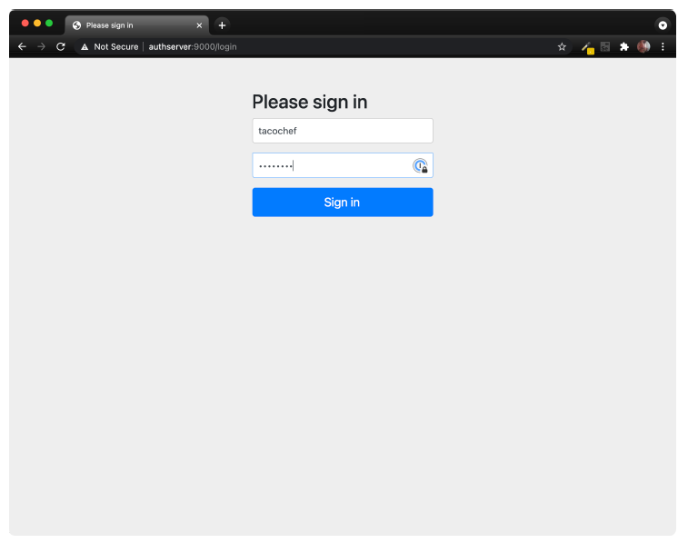
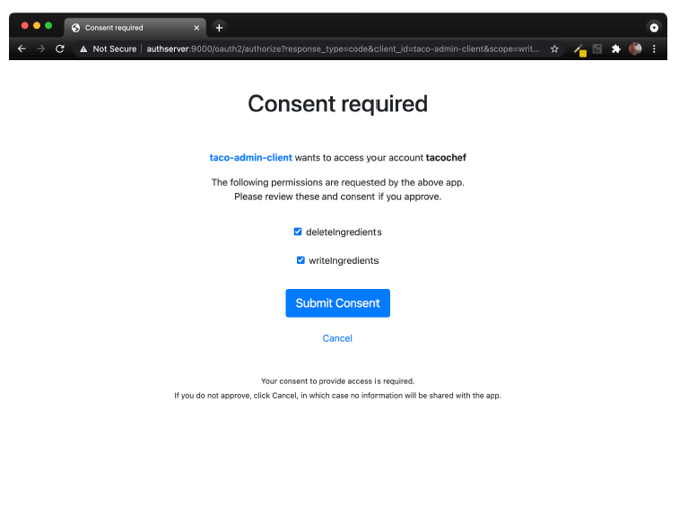
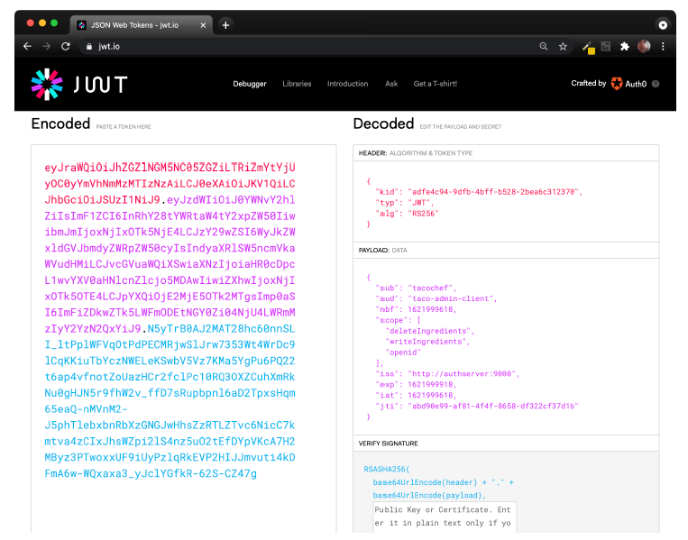

# 8.2 创建验证服务器

授权服务器的工作主要是代表用户发出访问令牌。像前面提到过，有几种授权服务器实现可供选择。但是我们将在项目中使用 Spring Authorization Server。Spring Authorization Server 是实验性的，并没有实现所有的 OAuth 2 授权类型，但它确实实现了授权 Code 授予和客户端凭据授予。

授权服务器是一个独立应该程序，不同于提供 API 的服务，也有别于客户端。因此，要开始使用Authorization Server，您需要创建一个新的 Spring Boot 项目，选择（至少）web 和 security starter。对于我们的授权服务器，用户将使用 JPA 存储在关系数据库中，因此请确保添加 JPA starter 和 H2 依赖。如果您用 Lombok 来处理 getter，setter、constructor 等等，确保也包括它。

Spring Authorization Server（尚未）作为 Initializr 设定项提供。所以如果您的项目已经创建，您需要手动添加 Spring Authorization Server 依赖。例如，这里是 pom.xml 文件中您需要包含的 Maven 依赖项：

```xml
<dependency>
  <groupId>org.springframework.security.experimental</groupId>
  <artifactId>spring-security-oauth2-authorization-server</artifactId>
  <version>0.1.2</version>
</dependency>
```

下一步，因为我们将在开发机器上运行所有这些程序（至少现在是这样），所以您需要确保主 Taco Cloud 应用程序和授权服务器没有端口冲突。将以下条目添加到项目的 application.yml 文件，将使授权服务器运行在端口 9000 上：

```yaml
server:
  port: 9000
```

现在，让我们深入了解授权服务器将使用的基本安全配置。清单 8.2 显示了一个非常简单的 Spring 安全配置类，它支持基于表单的登录，并要求对所有请求进行身份验证。

**程序清单 8.2 基于表单登录的基本安全配置。**
```java
package tacos.authorization;
import org.springframework.context.annotation.Bean;
import org.springframework.security.config.annotation.web.builders.
              HttpSecurity;
import org.springframework.security.config.annotation.web.configuration.
              EnableWebSecurity;
import org.springframework.security.core.userdetails.UserDetailsService;
import org.springframework.security.crypto.bcrypt.BCryptPasswordEncoder;
import org.springframework.security.crypto.password.PasswordEncoder;
import org.springframework.security.web.SecurityFilterChain;

import tacos.authorization.users.UserRepository;

@EnableWebSecurity
public class SecurityConfig {

  @Bean
  SecurityFilterChain defaultSecurityFilterChain(HttpSecurity http)
          throws Exception {
    return http
      .authorizeRequests(authorizeRequests ->
          authorizeRequests.anyRequest().authenticated()
      )

      .formLogin()

      .and().build();
  }

  @Bean
  UserDetailsService userDetailsService(UserRepository userRepo) {
    return username -> userRepo.findByUsername(username);
  }

  @Bean
  public PasswordEncoder passwordEncoder() {
    return new BCryptPasswordEncoder();
  }
}
```

注意，UserDetailsService 与 TacoUserRepository 一起工作，通过用户的用户名查找用户。为了只关注配置授权服务器本身，我们将跳过有关 TacoUserRepository 的细节，但只需说它看起来很像我们从第 3 章开始创建的基于 Spring Data 的存储库。

关于 TacoUserRepository，唯一值得注意的是（为了方便测试）您可以在 CommandLineRunner bean 中使用它，通过几个测试预填充用户到数据库：

```java
@Bean
public ApplicationRunner dataLoader(
          UserRepository repo, PasswordEncoder encoder) {
  return args -> {
    repo.save(
      new User("habuma", encoder.encode("password"), "ROLE_ADMIN"));
    repo.save(
      new User("tacochef", encoder.encode("password"), "ROLE_ADMIN"));
  };
}
```

现在，我们可以开始应用配置来启用授权服务器了。第一步，配置授权服务器就是创建一个新的配置类来导入一些授权服务器的通用配置。下面列出的 AuthorizationServerConfig 是一个良好的开端：

```java
@Configuration(proxyBeanMethods = false)
public class AuthorizationServerConfig {

  @Bean
  @Order(Ordered.HIGHEST_PRECEDENCE)
  public SecurityFilterChain authorizationServerSecurityFilterChain(HttpSecurity http)
    throws Exception {
    OAuth2AuthorizationServerConfiguration
        .applyDefaultSecurity(http);
    return http
        .formLogin(Customizer.withDefaults())
        .build();
  }

  ...
}
```

`authorizationServerSecurityFilterChain()` 方法定义 SecurityFilterChain，为 OAuth 2 授权服务器设置一些默认行为和一个默认的表单登录页面。`@Order` 注解的优先级为 Ordered.HIGHEST_PRECEDENCE。为了确保由于某种原因，如果声明了此类型的其他 bean，则此 bean 将优先于 bean。

在大多数情况下，就是样板配置。但如果您愿意，可以对其进行更深入的分析并进行自定义配置。现在，我们就使用默认值。

有一个组件不是样板配置，因此不是由 OAuth2AuthorizationServerConfiguration 提供的，就是客户端存储库。客户端存储库是类似于用户详细信息服务或用户存储库，不同之处在于不是维护详细信息用户，而是为请求授权需要询问的客户。它由 RegisteredClientRepository 接口定义，该接口如下所示：

```java
public interface RegisteredClientRepository {

  @Nullable
  RegisteredClient findById(String id);

  @Nullable
  RegisteredClient findByClientId(String clientId);

}
```

在生产环境中，您可以编写 RegisteredClientRepository 的实现类，从数据库或其他数据来源检索客户端详细信息。但是，Spring Authorization Server 提供了一个现成的内存实现，非常适合用于演示和测试目的。我们鼓励您实现适合自己的 RegisteredClientRepository。我们这里将使用内存中的实现，向授权服务器注册单个客户端。添加以下 bean 方法到 AuthorizationServerConfig 中：

```java
@Bean
public RegisteredClientRepository registeredClientRepository(
        PasswordEncoder passwordEncoder) {
  RegisteredClient registeredClient =
    RegisteredClient.withId(UUID.randomUUID().toString())
      .clientId("taco-admin-client")
      .clientSecret(passwordEncoder.encode("secret"))
      .clientAuthenticationMethod(
            ClientAuthenticationMethod.BASIC)
      .authorizationGrantType(AuthorizationGrantType.AUTHORIZATION_CODE)
      .authorizationGrantType(AuthorizationGrantType.REFRESH_TOKEN)
      .redirectUri(
            "http://127.0.0.1:9090/login/oauth2/code/taco-admin-client")
      .scope("writeIngredients")
      .scope("deleteIngredients")
      .scope(OidcScopes.OPENID)
      .clientSettings(
            clientSettings -> clientSettings.requireUserConsent(true))
      .build();
  return new InMemoryRegisteredClientRepository(registeredClient);
}
```

正如您所看到的，RegisteredClient 中有很多信息。自上而下，我们的客户端是这样定义的：

* ID：一个随机的、唯一的标识符。
* 客户端ID：类似于用户名，但不是用户，而是客户端。在这种情况下是“"taco-admin-client”。
* 客户端密码：类似于客户端的密码。这里我们用的 “secret” 这个词作为客户端机密。
* 授权授予类型：此客户端将支持的 OAuth 2 授权类型。在这种情况下，我们启用授权 Code 和刷新令牌授权。
* 重定向URL：在获得授权后，授权服务器可以重定向到的一个或多个已注册 URL。这增加了另一个安全级别，防止了任意应用程序无法接收授权码，而该授权码可用于交换令牌
* 作用域：允许此客户端请求的一个或多个 OAuth 2 作用域。这里我们设置三个作用域：“writeIngredients”、“deleteIngredients”和常量 OidcScopes.OPENID，解析为“openid”。当稍后使用授权服务器作为 Taco Cloud 管理程序的单点登录解决方案时，“openid”范围是必需的。
* 客户端设置：这是一个 lambda，允许我们自定义客户端设置。在这种情况下，在授予请求的范围之前，我们需要得到明确的用户同意。没有这个配置，授权范围将在用户登录后隐式授予。

最后，由于我们的授权服务器将生成 JWT 令牌，因此这些令牌需要使用 JSON Web Key（JWK）作为签名密钥。因此，我们将需要一些 bean 来生成 JWK。添加以下 bean 方法（和私有 helper 方法）到 AuthorizationServerConfig 中就能为我们完成这件工作：

```java
@Bean
public JWKSource<SecurityContext> jwkSource() {
  RSAKey rsaKey = generateRsa();
  JWKSet jwkSet = new JWKSet(rsaKey);
  return (jwkSelector, securityContext) -> jwkSelector.select(jwkSet);
}
private static RSAKey generateRsa() {
  KeyPair keyPair = generateRsaKey();
  RSAPublicKey publicKey = (RSAPublicKey) keyPair.getPublic();
  RSAPrivateKey privateKey = (RSAPrivateKey) keyPair.getPrivate();
  return new RSAKey.Builder(publicKey)
    .privateKey(privateKey)
    .keyID(UUID.randomUUID().toString())
    .build();
}
private static KeyPair generateRsaKey() {
  try {
    KeyPairGenerator keyPairGenerator = KeyPairGenerator.getInstance("RSA");
    keyPairGenerator.initialize(2048);
    return keyPairGenerator.generateKeyPair();
  } catch (Exception e) {
    return null;
  }
}
@Bean
public JwtDecoder jwtDecoder(JWKSource<SecurityContext> jwkSource) {
  return OAuth2AuthorizationServerConfiguration.jwtDecoder(jwkSource);
}
```

这里似乎比较复杂。但总而言之，JWKSource 创建了 2048 位的 RSA 密钥对，用于对令牌进行签名。令牌将使用私钥进行签名。然后，资源服务器可以通过获取来自授权服务器的公钥来进行验证。我们将在创建资源服务器时作进一步讨论。

我们的授权服务器的所有部分现在都已就绪。剩下要做的就是试试启动它。构建并运行应用程序，您应该有一个正在侦听 9000 端口的授权服务器。

由于我们还没有客户端，您可以使用 web 浏览器和 curl 命令行工具。首先，将 web 浏览器指向 http://localhost:9000/..._/taco-admin-client&scope=writeIngredients+deleteIngredients 。您将看到一个类似图 8.2 的登录页。


**图 8.2 授权服务器登录页。**

登录后（使用“tacochef”和“password”或某些用户名/密码组合登录，只要 TacoUserRepository 下的数据库有对应数据），将要求您同意上请求的作用域，如图 8.3 所示。


**图 8.3 授权服务器同意页面。**

授予同意后，浏览器将重定向回客户端 URL。既然我们没有客户端，那里可能什么都没有，您会收到一个错误。但没关系，我们假装是客户机，所以我们将自己从 URL 获取授权码。

查看浏览器的地址栏，您将看到 URL 有一个 code 参数。复制该参数的整个值，并在以下 curl 命令行中使用它来代替 $code：

```bash
$ curl localhost:9000/oauth2/token \
  -H"Content-type: application/x-www-form-urlencoded" \
  -d"grant_type=authorization_code" \
  -d"redirect_uri=http://127.0.0.1:9090/login/oauth2/code/taco-admin-client" \
  -d"code=$code" \
  -u taco-admin-client:secret
```

在这里，我们将用收到的授权码交换访问令牌。有效载荷采用“application/x-www-form-urlencoded”格式，并发送授权类型（“authorization_code”）、重定向URI（用于附加安全性）和授权码。如果一切顺利，那么您将收到一个 JSON 响应（格式化后）如下所示：

```json
{
  "access_token":"eyJraWQ...",
  "refresh_token":"HOzHA5s...",
  "scope":"deleteIngredients writeIngredients",
  "token_type":"Bearer",
  "expires_in":"299"
}
```

“access_token”属性包含客户端可用于向 API 发出请求的访问令牌。实际上，它比这里显示的要长得多。同样，“refresh_token”也已被删除，以节省空间。但是现在可以向授权范围是“WriteIngElements”或“DeleteIngElements”的资源发出请求时发送访问令牌了。访问令牌将在 299 秒（或不到 5 分钟）后过期，因此我们必须快速操作。如果它过期，可以使用刷新令牌获取新的访问令牌，而无需再次通过授权流。

那么，我们如何使用访问令牌呢？我们大概会向 Taco Cloud API 发送请求，作为“Authorization”请求头的一部分。像这样：

```bash
$ curl localhost:8080/ingredients \
  -H"Content-type: application/json" \
  -H"Authorization: Bearer eyJraWQ..." \
  -d'{"id":"FISH","name":"Stinky Fish", "type":"PROTEIN"}'
```

在这一点上，令牌对我们来说毫无用处。那是因为我们的 Taco Cloud API 还没有启用为资源服务器。但是，我们不使用实际的资源服务器和客户端 API，仍然可以通过复制访问令牌并粘贴到 [https://jwt.io](https://jwt.io) 进行解码校验。结果如图 8.4 所示。


**图 8.4 在 JWT.io 处解码 JWT 令牌。**

如您所见，令牌被解码为三个部分：报头、有效负载和签名。仔细查看有效负载可以发现，该令牌是代表名为“tacochef”的用户，令牌具有“WriteIngElements”和“DeleteComponents”作用域。正是我们想要的！

大约 5 分钟后，访问令牌将过期。您仍然可以在调试器中检查它：[https://jwt.io]https://jwt.io，但如果它是对 API 的实际请求中给出的，则会被拒绝。您可以请求新的访问令牌，而无需再次通过授权码授予流。您需要做的是使用“refresh_token”向授权服务器发出新请求，将刷新令牌作为“refresh_token”的参数进行传递。使用 curl 请求将如下所示：

```bash
$ curl localhost:9000/oauth2/token \
  -H"Content-type: application/x-www-form-urlencoded" \
  -d"grant_type=refresh_token&refresh_token=HOzHA5s..." \
  -u taco-admin-client:secret
```

对此请求的响应，与使用授权码交换初始访问令牌的请求返回，是基本相同的。仅多了新的访问令牌。

虽然将访问令牌粘贴到 [https://jwt.io](https://jwt.io) 很有趣，但访问令牌真正的威力和目的是用于访问 API。让我们看看如何在Taco Cloud API 上启用资源服务器。