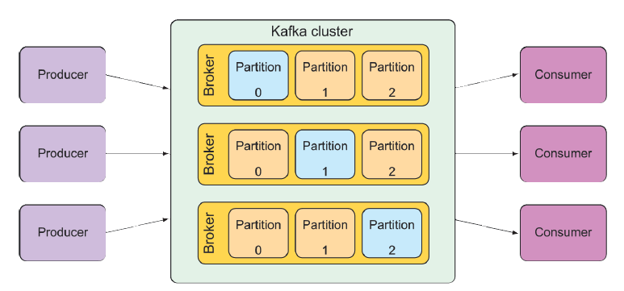

# 9.3 使用 Kafka 发送消息

Apache Kafka 是我们在本章中研究的最新消息传递选项。乍一看，Kafka 是一个消息代理，就像 ActiveMQ、Artemis 或 Rabbit 一样。但是 Kafka 有一些独特的技巧。

Kafka 被设计为在集群中运行，提供了巨大的可伸缩性。通过将其 topic 划分到集群中的所有实例中，它具有很强的弹性。RabbitMQ 主要处理 exchange 中的队列，而 Kafka 仅利用 topic 来提供消息的发布/订阅。

Kafka topic 被复制到集群中的所有 broker 中。集群中的每个节点充当一个或多个 topic 的 leader，负责该 topic 的数据并将其复制到集群中的其他节点。

更进一步说，每个 topic 可以分成多个分区。在这种情况下，集群中的每个节点都是一个 topic 的一个或多个分区的 leader，但不是整个 topic 的 leader。该 topic 的职责由所有节点分担。图 9.2 说明了这是如何工作的。

**图 9.3 Kafka 集群由多个 broker 组成，每一个都作为 topic 分区的 leader。**  

由于 Kafka 独特的构建风格，我鼓励您阅读由 Dylan Scott、Viktor Gamov 和 Dave Klein 合著的 _《Kafka 实战》_ （Manning, 2021）。在本书中我们将重点讨论如何使用 Spring 向 Kafka 发送和接收消息。

