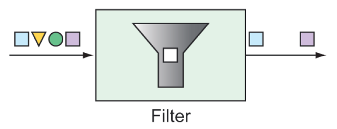

# 10.2.2 过滤器

过滤器可以放置在集成管道的中间，以允许或不允许消息进入流中的下一个步骤（如图 10.3）。



**图 10.3 基于某些条件的过滤器允许或不允许消息在管道中继续。**

例如，假设包含整数值的消息通过名为 numberChannel 的通道发布，但是只希望偶数传递到名为 evenNumberChannel 的通道。在这种情况下，可以使用 @Filter 注解声明一个过滤器，如下所示：

```java
@Filter(inputChannel="numberChannel",
    outputChannel="evenNumberChannel")
public boolean evenNumberFilter(Integer number) {
  return number % 2 == 0;
}
```

或者，如果您使用 Java DSL 配置风格来定义集成流，您可以这样调用 `filter()`：

```java
@Bean
public IntegrationFlow evenNumberFlow(AtomicInteger integerSource) {
  return IntegrationFlows
    ...
    .<Integer>filter((p) -> p % 2 == 0)
    ...
    .get();
}
```

在本例中，使用 lambda 表达式实现过滤器。但是，事实上，`filter()` 方法是接收一个 GenericSelector 作为参数。这意味着可以实现 GenericSelector 接口，而不是引入一个简略的 lambda 表达式实现过滤。

