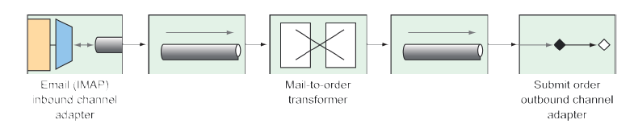

# 10.3 创建 Email 集成流

Taco Cloud 应该能让它的用户通过 email 提交他们的 taco 设计和放置订单。您在报纸上通过发送传单和放置外卖广告，邀请大家通过电子邮件发送 taco 订单。这样做很成功！不幸的是，它有点太过于"成功"了。有这么多的电子邮件中，您必须雇用临时工做一些，无非就是阅读完所有的信件，并提交订单的详细信息到订购系统来的工作。

在本节中，将实现一个集成信息流，用于轮询 Taco Cloud 收件箱中的 taco 订单电子邮件，并解析邮件订单的详细信息，然后提交订单到 Taco Cloud 进行处理。总之，您将从邮箱端点模块中使用入站通道适配器，用于把 Taco Cloud 收件箱中的邮件提取到集成中。

下一步，在集成信息流中，电子邮件将被解析为订单对象，接着被扇出到另外一个向 Taco Cloud 的 REST API 提交订单的处理器中，在那里，它们将如同其他订单一样被处理。首先，让我们定义一个简单的配置属性的类，来捕获如何处理 Taco Cloud 电子邮件的细节：

```java
package tacos.email;

import org.springframework.boot.context.properties.ConfigurationProperties;
import org.springframework.stereotype.Component;
import lombok.Data;

@Data
@ConfigurationProperties(prefix="tacocloud.email")
@Component
public class EmailProperties {

  private String username;
  private String password;
  private String host;
  private String mailbox;
  private long pollRate = 30000;

  public String getImapUrl() {
    return String.format("imaps://%s:%s@%s/%s",
        this.username, this.password, this.host, this.mailbox);
  }
}
```

正如您所看到的，EmailProperties 使用 `get()` 方法来产生一个 IMAP URL。流就使用这个 URL 连接到 Taco Cloud 的电子邮件服务器，然后轮询电子邮件。所捕获的属性中包括，用户名、密码、IMAP服务器的主机名、轮询的邮箱和该邮箱被轮询频率（默认为 30 秒轮询一次）。

该 EmailProperties 类是在类的级别使用了 `@ConfigurationProperties` 注解，注解中 prefix 被设置为 tacocloud.email。这意味着，可以在 application.yml 配置文件中详细配置 email 的信息：

```yaml
tacocloud:
  email:
    host: imap.tacocloud.com
    mailbox: INBOX
    username: taco-in-flow
    password: 1L0v3T4c0s
    poll-rate: 10000
```

当然，此处显示的电子邮件服务器配置是由以下部分组成的。您需要把它调整到匹配您将使用的电子邮件服务器详细信息。

此外，您可能会在 IDE 中收到“unknown property”警告。那是因为 IDE 是寻找元数据以理解这些属性的含义。警告不会破坏实际代码，可以忽略它们。或者您可以消除它们，将以下依赖项添加到构建中（也可以使用 Spring Initializr 勾选“Spring Configuration Processor”选项）：

```xml
<dependency>
  <groupId>org.springframework.boot</groupId>
  <artifactId>spring-boot-configuration-processor</artifactId>
  <optional>true</optional>
</dependency>
```

此依赖项包括对自动生成自定义元数据的支持，例如我们用于配置电子邮件服务器详细信息的属性。

现在，让我们使用 EmailProperties 来配置集成流。您的目标是什么 create 看起来有点像图 10.10。


**图 10.10 通过电子邮件接受塔可订单的集成流程。**

定义这个流程时有两种选择：

* _定义在 Taco Cloud 应用程序本身里面_ -- 在流结束的位置，服务激活器将调用定义了的存储库来创建 taco 订单。
* _定义在一个单独的应用程序中_ -- 在流结束的位置，服务激活器将发送 POST 请求到 Taco Cloud API 来提交 taco 订单。

无论选择那种服务激活器的实现，对流本身没有什么影响。但是，因为您会需要一些类型来代表的 tao、order 和 ingredient，这些需要与您在 Taco Cloud 应用程序中定义的那些有一些不一样。因此在一个单独的应用程序中集成信息流，可以避免与现有的域类型混淆进行。

还可以选择使用 XML 配置、Java 配置或 Java DSL 来定义流。我比较喜欢 Java DSL 的优雅，哈哈，这就是您会用到的。随意啦，您如果对一点点额外的挑战有兴趣，可以使用其他配置风格来书写这个流。现在，让我们来看看在 Java DSL 配置下的 taco 订单电子邮件流。

** 程序清单 9.5 定义一个集成流接收电子邮件并将它们作为订单提交。**
```java
package tacos.email;

import org.springframework.context.annotation.Bean;
import org.springframework.context.annotation.Configuration;
import org.springframework.integration.dsl.IntegrationFlow;
import org.springframework.integration.dsl.IntegrationFlows;
import org.springframework.integration.dsl.Pollers;
import org.springframework.integration.mail.dsl.Mail;

@Configuration
public class TacoOrderEmailIntegrationConfig {

  @Bean
  public IntegrationFlow tacoOrderEmailFlow(
    EmailProperties emailProps,
    EmailToOrderTransformer emailToOrderTransformer,
    OrderSubmitMessageHandler orderSubmitHandler) {

  return IntegrationFlows
    .from(Mail.imapInboundAdapter(emailProps.getImapUrl()),
      e -> e.poller(
        Pollers.fixedDelay(emailProps.getPollRate())))
    .transform(emailToOrderTransformer)
    .handle(orderSubmitHandler)
    .get();
  }
}
```

taco 订单电子邮件流（在 `tacoOrderEmailFlow()` 方法中的定义）是由三个不同的部分组成：

* _IMAP 电子邮件入站信道适配器_ —— 根据 EmailProperties 的 `getImapUrl()` 方法返回的 IMP URL 来创建通道适配器，根据 pollRate属性来设定轮询延时。进来的电子邮件被移交到它连接到转换器的通道。
* _一种将电子邮件转换为订单对象的转换器_ —— 在 EmailToOrderTransformer 中实现的转换器，其被注入到 tacoOrderEmailFlow() 方法中。从转换中所产生的订单通过另外一个通道扇出到最终组件中。
* *处理程序（作为出站通道适配器）—— 处理程序接收一个订单对象，并将其提交到 Taco Cloud 的 REST API。

可以通过将 Email 端点模块作为项目构建的依赖项，就可以对 `Mail.imapInboundAdapter()` 进行调用。Maven 的依赖关系如下所示：

```markup
<dependency>
  <groupId>org.springframework.integration</groupId>
  <artifactId>spring-integration-mail</artifactId>
</dependency>
```

EmailToOrderTransformer 这个类，通过继承 AbstractMailMessageTransformer 的方式，实现了 Spring Integration 中的 Transformer 接口，如程序清单 10.6 所示。

**程序清单 10.6 使用集成转换器将到来的邮件转换为 taco 订单。**
```java
package tacos.email;

import java.io.IOException;
import java.util.ArrayList;
import java.util.List;
import javax.mail.Message;
import javax.mail.MessagingException;
import javax.mail.internet.InternetAddress;
import org.apache.commons.text.similarity.LevenshteinDistance;
import org.springframework.integration.mail.transformer
            .AbstractMailMessageTransformer;
import org.springframework.integration.support
            .AbstractIntegrationMessageBuilder;
import org.springframework.integration.support.MessageBuilder;
import org.springframework.stereotype.Component;

@Component
public class EmailToOrderTransformer
    extends AbstractMailMessageTransformer<EmailOrder> {

  private static final String SUBJECT_KEYWORDS = "TACO ORDER";

  @Override
  protected AbstractIntegrationMessageBuilder<EmailOrder>
        doTransform(Message mailMessage) throws Exception {
    EmailOrder tacoOrder = processPayload(mailMessage);
    return MessageBuilder.withPayload(tacoOrder);
  }

  private EmailOrder processPayload(Message mailMessage) {
  try {
    String subject = mailMessage.getSubject();
      if (subject.toUpperCase().contains(SUBJECT_KEYWORDS)) {
        String email =
          ((InternetAddress) mailMessage.getFrom()[0]).getAddress();
        String content = mailMessage.getContent().toString();
        return parseEmailToOrder(email, content);
      }
    } catch (MessagingException e) {
    } catch (IOException e) {}
    return null;
  }

  private EmailOrder parseEmailToOrder(String email, String content) {
    EmailOrder order = new EmailOrder(email);
    String[] lines = content.split("\\r?\\n");
    for (String line : lines) {
      if (line.trim().length() > 0 && line.contains(":")) {
        String[] lineSplit = line.split(":");
        String tacoName = lineSplit[0].trim();
        String ingredients = lineSplit[1].trim();
        String[] ingredientsSplit = ingredients.split(",");
        List<String> ingredientCodes = new ArrayList<>();
        for (String ingredientName : ingredientsSplit) {
          String code = lookupIngredientCode(ingredientName.trim());
          if (code != null) {
            ingredientCodes.add(code);
          }
        }
        Taco taco = new Taco(tacoName);
        taco.setIngredients(ingredientCodes);
        order.addTaco(taco);
      }
    }
    return order;
  }

  private String lookupIngredientCode(String ingredientName) {
    for (Ingredient ingredient : ALL_INGREDIENTS) {
      String ucIngredientName = ingredientName.toUpperCase();
      if (LevenshteinDistance.getDefaultInstance()
            .apply(ucIngredientName, ingredient.getName()) < 3 ||
          ucIngredientName.contains(ingredient.getName()) ||
          ingredient.getName().contains(ucIngredientName)) {
        return ingredient.getCode();
      }
    }
    return null;
  }
  private static Ingredient[] ALL_INGREDIENTS = new Ingredient[] {
    new Ingredient("FLTO", "FLOUR TORTILLA"),
    new Ingredient("COTO", "CORN TORTILLA"),
    new Ingredient("GRBF", "GROUND BEEF"),
    new Ingredient("CARN", "CARNITAS"),
    new Ingredient("TMTO", "TOMATOES"),
    new Ingredient("LETC", "LETTUCE"),
    new Ingredient("CHED", "CHEDDAR"),
    new Ingredient("JACK", "MONTERREY JACK"),
    new Ingredient("SLSA", "SALSA"),
    new Ingredient("SRCR", "SOUR CREAM")
  };
}
```

AbstractMailMessageTransformer 是处理其有效载荷为电子邮件消息的基类，其着重于，从到来的消息中将邮件信息提取到，通过 `doTransform()` 方法传入的 Message 对象中。

在 `doTransform()` 方法中，把 Message 传递到名 `processPayload()` 的 private 方法中，在其中将电子邮件解析为 Order 对象。这里的 Order 对象与 Taco Cloud 主应用程序中的 Order 对象虽然有些相似，但是还是不同的，它稍微简单一些：

```java
package tacos.email;
import java.util.ArrayList;
import java.util.List;
import lombok.Data;

@Data
public class EmailOrder {
  private final String email;
  private List<Taco> tacos = new ArrayList<>();

  public void addTaco(Taco taco) {
    this.tacos.add(taco);
  }
}
```

与用于在客户的整个交付和账单信息不同，这个 Order 类只携带了客户的电子邮件。

将电子邮件解析为 taco 订单是一个有意义的事情。事实上，即使是一个简单的实现，都会涉及到几十行代码。而这几十行的代码对 Spring Integration 和如何实现转换器的讨论是没有更多的帮助的。因此，为了节省空间，准备放下对 `processPayload()` 方法的详细实现。

该 EmailToOrderTransformer 做的最后一件事就是返回包含 Order 对象有效载荷的 MessageBuilder。由 MessageBuilder 产生的消息，被发送到集成信息流的最后一个部分：消息处理器，推送订单到 Taco Cloud API。OrderSubmitMessageHandler，如下所示，实现了 Spring Integration 的 GenericHandler 接口，用于处理携带 Order 有效载荷的消息。

**程序清单 10.7 通过消息处理器传输订单到 Taco Cloud API。**
```java
package tacos.email;

import org.springframework.integration.handler.GenericHandler;
import org.springframework.messaging.MessageHeaders;
import org.springframework.stereotype.Component;
import org.springframework.web.client.RestTemplate;

@Component
public class OrderSubmitMessageHandler
    implements GenericHandler<EmailOrder> {

  private RestTemplate rest;
  private ApiProperties apiProps;

  public OrderSubmitMessageHandler(ApiProperties apiProps, RestTemplate rest) {
    this.apiProps = apiProps;
    this.rest = rest;
  }
  @Override
  public Object handle(EmailOrder order, MessageHeaders headers) {
    rest.postForObject(apiProps.getUrl(), order, String.class);
    return null;
  }
  }
```

为了满足 GenericHandler 接口的要求，OrderSubmitMessageHandler 重写 `handle()` 方法。这个方法接收传入 Order 对象，并使用注入的 RestTemplate 通过 POST 请求中注入 ApiProperties 对象捕获的 URL 提交订单。最后，handler() 方法返回 null 以指示流处理结束。

ApiProperties 是为了避免在调用 `postForObject()` 方法时对 URL 进行硬编码。这是一个配置属性文件，看起来像这样：

```java
@package tacos.email;

import org.springframework.boot.context.properties.ConfigurationProperties;
import org.springframework.stereotype.Component;
import lombok.Data;

@Data
@ConfigurationProperties(prefix = "tacocloud.api")
@Component
public class ApiProperties {
  private String url;
}
```

在 application.yml，Taco Cloud API 的 URL 可能会像这样被配置：

```yaml
tacocloud:
  api:
    url: http://localhost:8080/orders/fromEmail
```

为了使 RestTemplate 在项目中可用，它被注入到 OrderSubmitMessageHandler 中，需要将 Spring Boot web starter 中添加到项目构建中：

```markup
<dependency>
  <groupId>org.springframework.boot</groupId>
  <artifactId>spring-boot-starter-web</artifactId>
</dependency>
```

这使得 RestTemplate 在 classpath 中可用，这也触发了 Spring MVC 的自动配置。作为一个独立的 Spring Integration 流，应用程序并不需要 Spring MVC，或是嵌入的Tomcat。因此，您应该在 application.yml 中禁用 Spring MVC 的自动配置：

```yaml
spring:
  main:
  web-application-type: none
```

spring.main.web-application-type 属性可以被设置为 servlet、reactive 或是 none，当 Spring MVC 在 classpath 中时，自动配置将这个值设置为 servlet。但是这里需要将其重写为 none，这样 Spring MVC 和 Tomcat 就不会自动配置了。（我们将在 12 章讨论将其作为一个响应式 web 应用程序的意义）。


